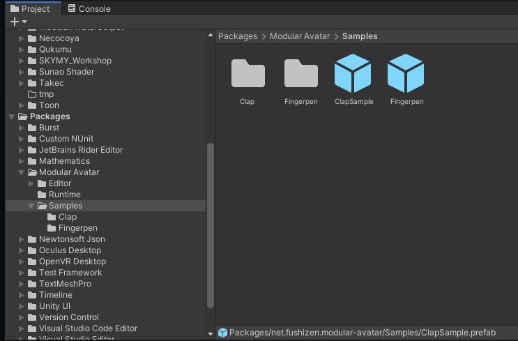

---
sidebar_position: 3
sidebar_label: サンプルアセット
---

# サンプルアセット

Modular Avatarには、機能の使い方を見せるためのサンプルプレハブがいくつか同封されています。Projectウィンドウの中で、`Packages -> Modular Avatar -> Samples`に入っています。

## 指ペン(Fingerpen) {#fingerpen}

どこでも使える、便利な指ペンプレハブ。
アバターにオブジェクトを追加するだけで導入が完了します（アクションメニュー直下に導入されます）。
メニュー位置を調整したい場合は、Menu Installerコンポーネントの中のSelect Menuボタンを押して、追加させたいメニューを選んでください。

指ペンプレハブは以下の機能のサンプルとなっています。

* [Merge Animator](/docs/reference/merge-animator)でアニメーターをインストール
* [同期パラメーター](/docs/reference/parameters)の自動設定
* [メニュー](/docs/reference/menu-installer)の自動インストール
* [Bone Proxy](/docs/reference/bone-proxy)で、様々のアバターに対応した、アバターのボーンにオブジェクトを導入する方法

## 拍手(Clap) {#clap}

Clapプレハブをアバターに入れることで、手を合わせると拍手の効果音が流れ、パーティクルがでます。
指ペンと同様、Select MenuでON・OFFスイッチの位置を指定できます。

指ペンでも紹介される機能のほかにも、Contact Receiverの値を内部パラメーターにすることで、他のアセットとの干渉を避ける仕組みのサンプルとなっています。