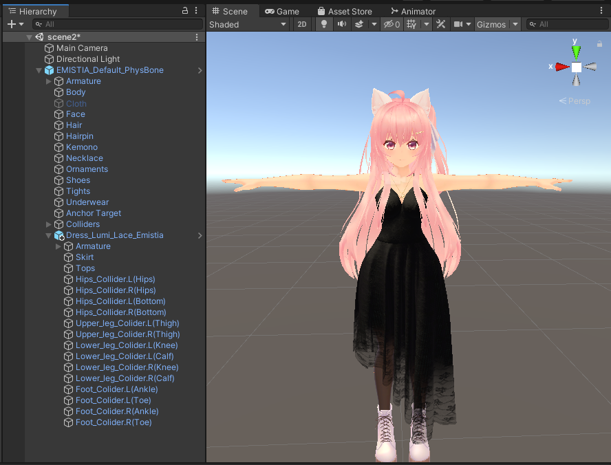
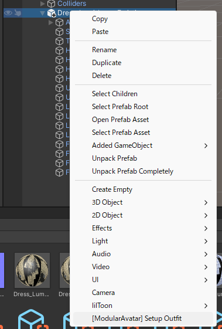

# 複雑なCloth衣装セットアップ

自動セットアップでは対処しきれない衣装もあります。ラケシアさんの[ドレス・ルミー](https://lachexia.booth.pm/items/3763311)
を例に見てみましょう。

このチュートリアルは[簡単な衣装チュートリアル](/docs/tutorials/clothing)を通過したことを前提に、そちらの方で詳しく解説した部分を
一部割愛します。

まずは、ドレス・ルミーのプレハブをアバターにドロップし、衣装の一部と干渉する部分を隠しておきます（Clothを消し、Underwearの`bra_off`シェープキーを入れて、
Bodyの各種シェープキーを調整したところです）。

見ての通り、この衣装はオブジェクトがたくさんついています。[簡単な衣装チュートリアル](/docs/tutorials/clothing)で使った自動設定は
Merge Armatureコンポーネントを作ってくれますが、それ以外のオブジェクトはもう少し手間がかかります。とはいえ、最初は
自動セットアップで行きましょう。

次は、コライダーオブジェクトがベースボーンと一緒に動かせるためにBone Proxyコンポーネントを作ります。
まずはHips_Colliderオブジェクトを全部選択し、`MA Bone Proxy`コンポーネントを一括で追加します。
`ターゲット`には、元のアバターのHipsオブジェクトをドラッグ＆ドロップします。

配置モードは自動的に「子として・ワールド位置を維持」に更新されます。

他のボーン・コライダーにも同じ設定をしましょう。

これでクロスコライダーがちゃんと動くようになります。

最後に、SkirtとTopsにBlendshape Syncコンポーネントを追加します。

## 他にできること

Merge Animatorを使って、アニメーターでBodyのブレンドシェープ（torso_thin => 100, elbow_off => 0, bra_off => 100）を設定し、
Clothをオフにすればこの衣装の設定を完全に自動化することもできます。
ただし、衣装変更アニメーションと干渉する可能性が高いので、非推奨です。