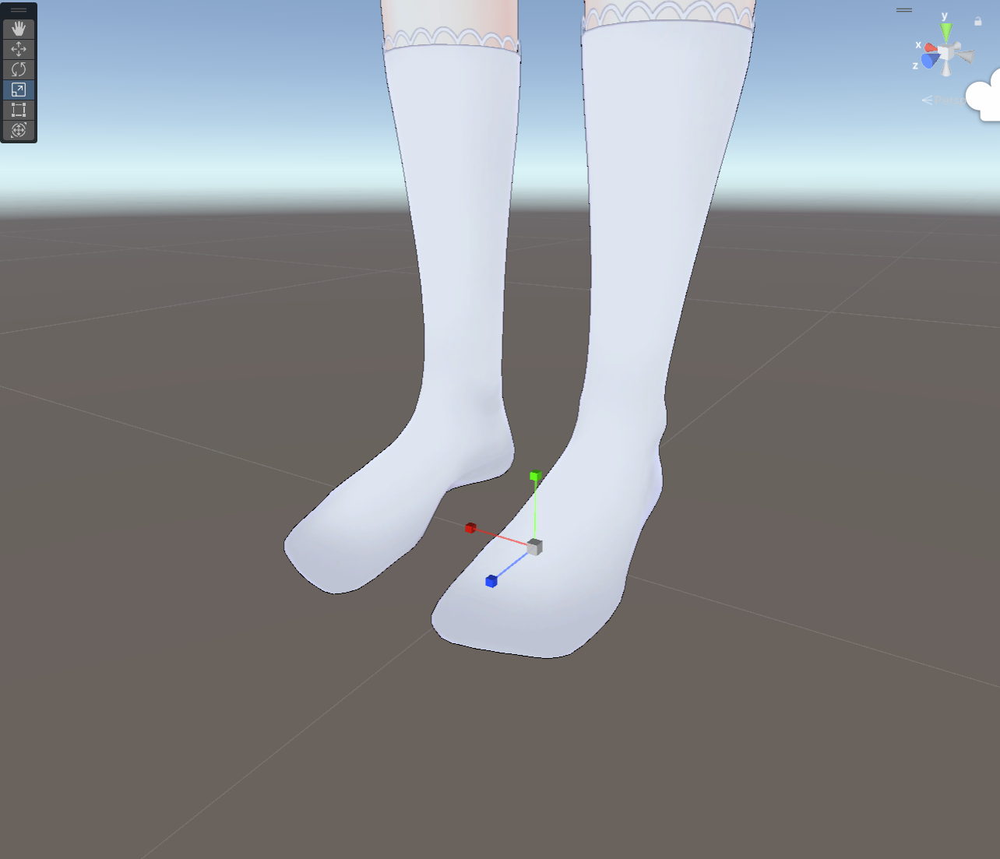
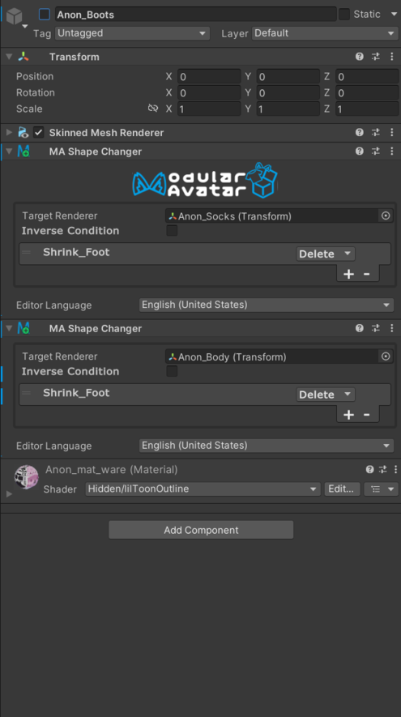
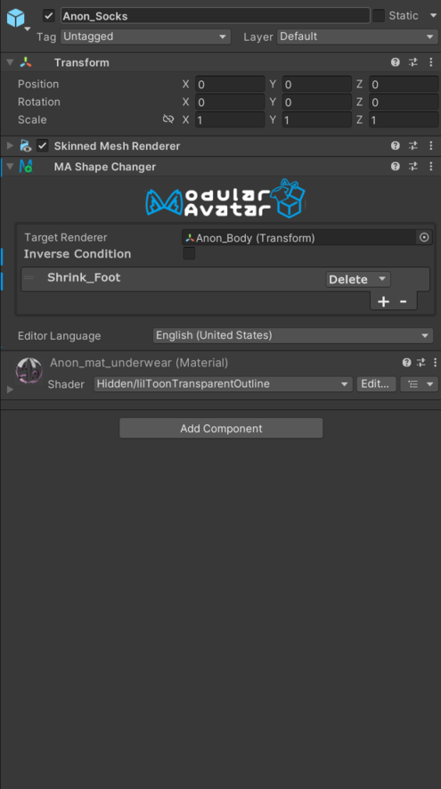

# （続）トグルの設定

まず始める前に、[簡単なオブジェクトトグルチュートリアル](/docs/tutorials/object_toggle/)を読んでおいてください。
このチュートリアルでは、オブジェクトをトグルする際にブレンドシェイプを更新する方法を紹介します。

多くのアバターには「シュリンクブレンドシェイプ」と呼ばれるものが付属しており、これは衣服に素体がめり込むことを防ぐために使われます。
これらのブレンドシェイプは、衣服アイテムを表示・非表示にするためのトグルと一緒に使用されることがよくあります。

Modular Avatar の [`Shape Changer`](/docs/reference/reaction/shape-changer/) コンポーネントを使用することで、これらのブレンドシェイプを
簡単に設定できます。例として、あのんちゃんの靴下と靴を見てみましょう。

<figure>

<figcaption>靴あり状態のあのんちゃん</figcaption>
</figure>

<figure>

<figcaption>靴OFF状態</figcaption>
</figure>

見ての通り、靴をOFFにすると、中から棒状のものが見えます。これは靴下と足がシュリンクブレンドシェイプで隠されているためです。
まずは、これらをゼロにリセットしましょう。

<figure>

<figcaption>Anon_body のブレンドシェープ</figcaption>
</figure>

<figure>

<figcaption>ソックスのブレンドシェープ</figcaption>
</figure>

<figure>

<figcaption>リセット後の状態</figcaption>
</figure>

次に、Shape Changer を設定して、隠された部位を非表示にします。靴と靴下のオブジェクトそれぞれに追加し、その下のものを縮小します。

<figure>

<figcaption>靴に付属するShape Changer</figcaption>
</figure>

<figure>

<figcaption>靴下に付属するShape Changer</figcaption>
</figure>

ここで、`Delete` を使用しています。こうすることで、実際にこのオブジェクトをOFFにできるアニメーションが存在しない場合、指定したブレンドシェープ
を操作する変わりに、ポリゴンを削除することができます。アニメーションがある場合は、変わりにブレンドシェープを１００に設定することになります。
ポリゴンを残したい場合は `Set` に変更してください。

Shape Changer はエディタ内で効果をプレビューしますが、正しく設定すると何もしていないように見えます。
確認するには、デバッグオーバーレイボタンをクリックし、`Overdraw` を選択して透過表示を確認します。
逆に、縮小しすぎた場合はシーンビューですぐにわかります。

<figure style={{"width": "100%"}}>

<figcaption>Overdraw のデバッグ表示設定</figcaption>
</figure>

<figure>

<figcaption>Overdraw にするとこんな感じです</figcaption>
</figure>

Shape Changer を設定したら、次はトグルを設定します。まず、サブメニューを作成しましょう。
新しいゲームオブジェクトを作成し、`Menu Installer` と `Menu Item` を追加します。次に、Menu Itemのタイプを `Submenu` に設定します。

<figure>

<figcaption>Submenu 設定</figcaption>
</figure>

次に、このサブメニューの下に新しいトグルを追加します。`トグルを作成` をクリックして、このサブメニューの下に新しいトグルを作成します。
新しい名前を付け、靴のオブジェクトを追加します。ソックスについても同様に行います。

<figure>

<figcaption>靴のトグル設定</figcaption>
</figure>

<figure>

<figcaption>靴下のトグル設定</figcaption>
</figure>

:::warning

トグルの効果をプレビューするには、メニューアイテムの `Default` チェックボックスをクリックしてください。靴が消えます。
ただし、現在のバージョンの Modular Avatar では、エディタ内でトグルによるブレンドシェイプへ影響までプレビューすることはできません。
これについては、Avatar 3.0 Emulator や Gesture Manager を使用してプレイモードでテストしてください。

この制限は、今後のバージョンで改善される予定です。

:::

完了です！これで、あのんちゃんの靴と靴下をトグルするメニューアイテムを作成しました。
このように、Modular Avatar の Shape Changer を使用することで、簡単に衣服アイテムの表示・非表示を設定できます。

:::tip

衣装作者も Shape Changer を事前に設定しておくことで、衣服の導入を簡単に行えるようになります。
Reactive Object システムは、他の NDMF 互換システムによって作成されたアニメーションに応答しますので、
ユーザーが Modular Avatar のトグルシステムを使用しなくても、ブレンドシェイプを自動的に設定できます。

:::