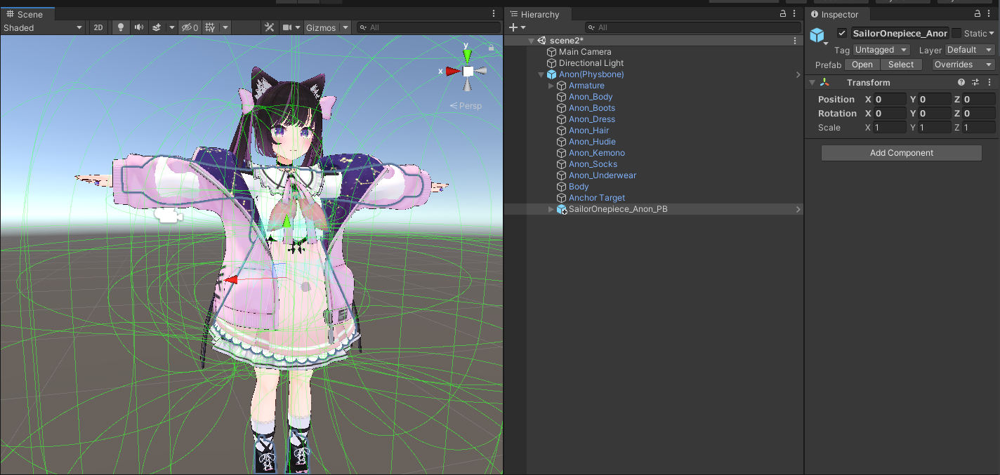
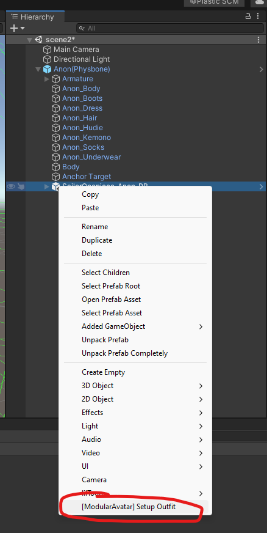
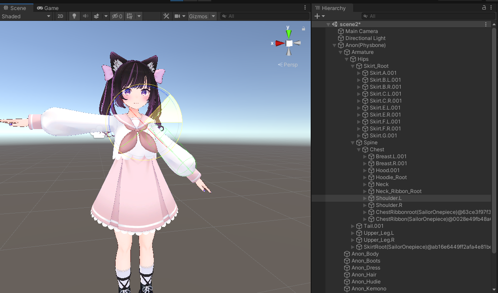
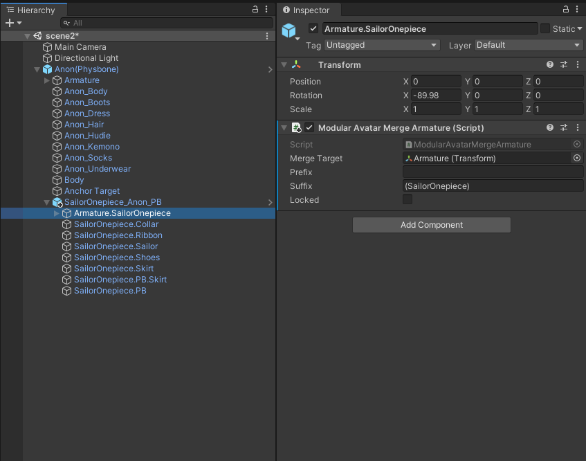
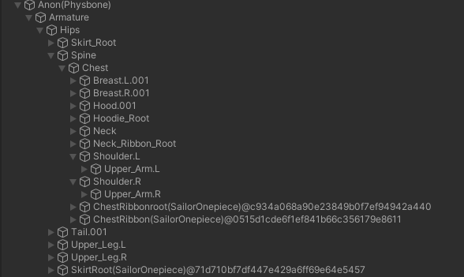
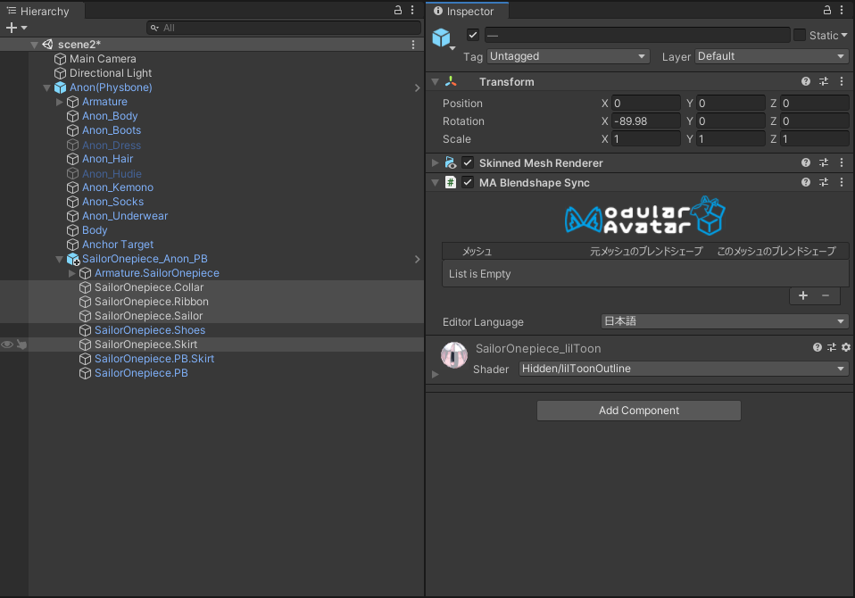
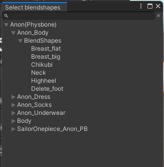
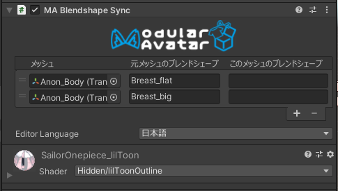

---
sidebar_position: 1
sidebar_label: 簡単な衣装セットアップ
---

# 簡単な衣装セットアップ

## チュートリアル

Modular Avatarを使えば、ワンクリックで簡単な衣装を導入できます。やってみましょう！

今回はかぷちやさんの[セーラーワンピース](https://capettiya.booth.pm/items/3795694)を長兎路こよりさんの[あのんちゃん](https://booth.pm/ja/items/3564947)に導入します。
VRCSDKやModular Avatar自体の導入や、各アセットのインポートが終わったところから始めます。

まずは衣装のプレハブをそのままアバターの中に置きます。

次に、衣装オブジェクトを右クリックし、`[ModularAvatar] Setup Outfit`を選択します。

アニメーターセットアップはお好きな方法でできます。この`SailorOnepiece_Anon_PB`オブジェクトをON/OFFすることで衣装全体を表示・非表示にできます。
テストのため、一旦手動で元の衣装をオフにしましょう。

プレイモードに入れば、ちゃんと衣装がアバターのアーマチュアに追従していることがわかります。

衣装を外したいときは、普通にヒエラルキーから削除するだけでOKです。

:::tip

Modular Avatarでは、元々のアバターや衣装プレハブをUnpackする必要はありません！これで新バージョンが出たときなど、アバターや衣装のバージョン更新が楽ちん！

:::

## ここで一体何が起きた？！

`Setup Outfit`を選択すると、Modular
Avatarが自動的に衣装の中のアーマチュアを見つけ出して、[Merge Armature](/docs/reference/merge-armature)コンポーネントを追加します。

このコンポーネントはプレイモードに入った瞬間、衣装のボーンヒエラルキーを自動的に元のアバターに統合させます。統合する過程で、不要なボーンを最小限にしつつ、
Physics Bone等のアクティブコンポーネントを元の位置に残すことで難しいことを考えずにアニメーター製作できるように調整します。

プレイモードでアバターを開くと、統合後の状態が見れます。

見ての通り、新衣装用のボーンがアバターのアーマチュアに追加されたが、共通ボーンが元のアバターのアーマチュアに統合されます。
（ちなみにボーンの位置をずらして調整しても大丈夫です！）

ちょっとごちゃごちゃになっていますが、プレイモードから出れば元通りの片付いた状態に戻ります。

## ブレンドシェープ同期

衣装のブレンドシェープが元アバターと同期するように設定できます。まずは、ブレンドシェープが同期すべきオブジェクトにMA Blendshape Syncコンポーネントを追加しましょう。

次は + ボタンを押しましょう。すると、ブレンドシェープを選択するウィンドウが開きます。畳まれたアイテムを開き、元アバターにある参照すべきメッシュ・ブレンドシェープを探しましょう。

同期したいブレンドシェープをダブルクリックするとBlendshape Syncコンポーネントに追加されます。「このメッシュのブレンドシェープ」を記入すると、衣装側のブレンドシェープ名を指定できますが、
記入しなかったら元アバターと同じブレンドシェープ名を採用します。

設定を終えると、Modular Avatarが自動的に元メッシュから新衣装にブレンドシェープ値を同期します。エディタ・インスペクター内だけでなく、
アニメーションで操作する場合はアップしたあとも同期されます。