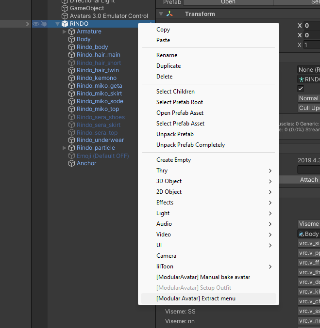
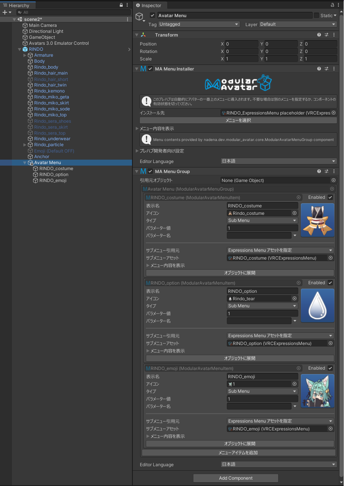
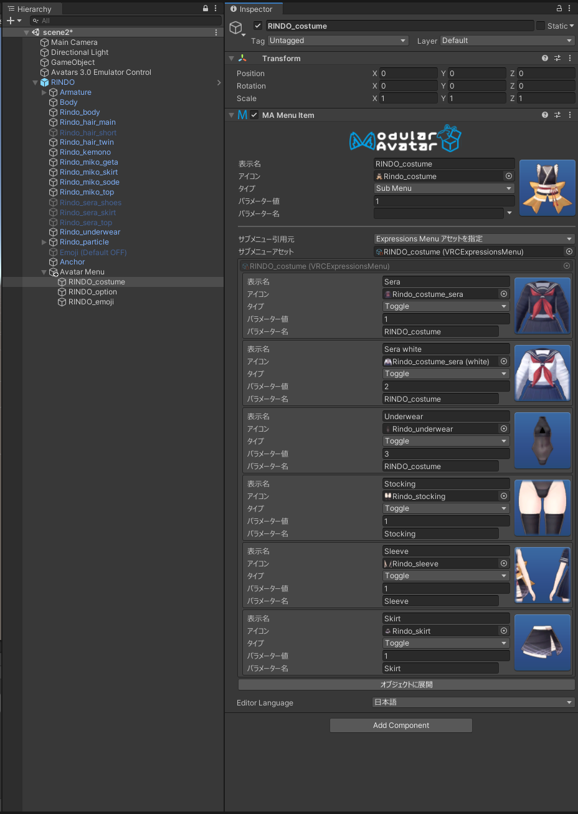
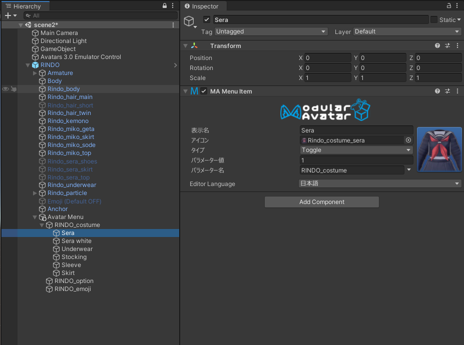
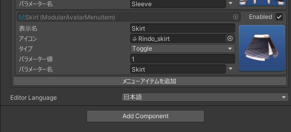
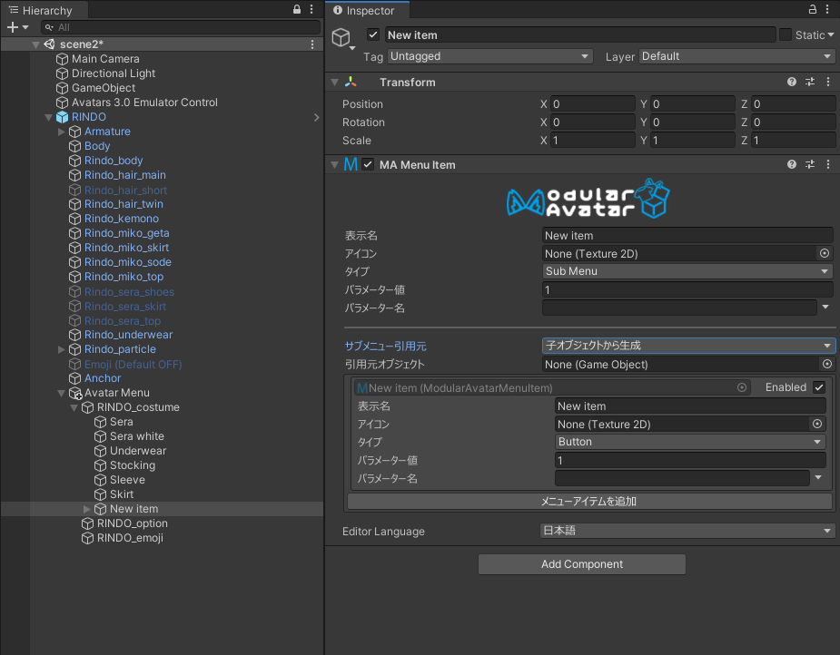
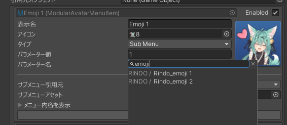

# メニューを編集

Modular Avatarには、オブジェクトベースのメニュー編集機能があります。これを使うと、Unityのインスペクターから簡単にメニューを編集したり、インスペクターだけでシンプルなトグルを作成したりできます。

このチュートリアルでは、既存のアバターのメニューを編集する方法と、アセットに含める方法を紹介します。

## 既存アバターのメニューを変換します

一番簡単に始める方法は、既存のアバターのメニューを変換することです。アバターを右クリックして、`[Modular Avatar] Extract menu`を選択します。

When you do this, a new `Avatar Menu` object will be added to your avatar, containing the top level of your avatar's menu.

すると、新しい`Avatar Menu`オブジェクトがアバターに追加されます。これには、アバターのメニュートップの項目が入っています。

御覧の通り、メニューアイテムがオブジェクト化しています。各メニューアイテムを個別に見ることもできます。

「オブジェクトに展開」ボタンを押すと、このサブメニューも変換できます。これでメニューの各階層をヒエラルキーで見れます。

オブジェクト化したら、アイテムをドラッグアンドドロップでメニュー内で移動させられます。

### 新規メニュー項目を追加

メニューを展開したら、「メニューアイテムを追加」ボタンを押すことで新しい項目を追加できます。

リストの最後に新規アイテムが追加されます。そのあと名前、タイプ、パラメーターなどを設定できます。

サブメニューを作るなら、「タイプ」を「Sub Menu」にして、「サブメニューの引用元」を「子オブジェクトから生成」にしましょう。そしたら、サブメニューオブジェクトから「メニューアイテムを追加」を押すことで追加できます。

### パラメーター設定

パラメーターを設定するときは、パラメーター名欄の右にある矢印を押すことで、名前で検索できます。親にあるMA Parametersコンポーネントも考慮されます。

## 配布アセットなどでの応用

新しいメニューアイテムシステムを配布アセットなどでも利用できます。サンプルとしては、FingerpenやSimpleToggleアセットにご参照ください。

簡単に解説すると、一つの項目またはサブメニューを追加するなら、MA Menu InstallerとMA Menu Itemを両方同じオブジェクトに追加してください。Menu Itemがアバターに自動的に追加されます。
サブメニューにグループしないで複数の項目を追加する場合は、MA Menu InstallerとMA Menu Groupを両方追加しましょう。Menu Groupはサブメニューに入れずに複数の項目を追加できるようにするコンポーネントです。Extract menuと同じ仕様です。