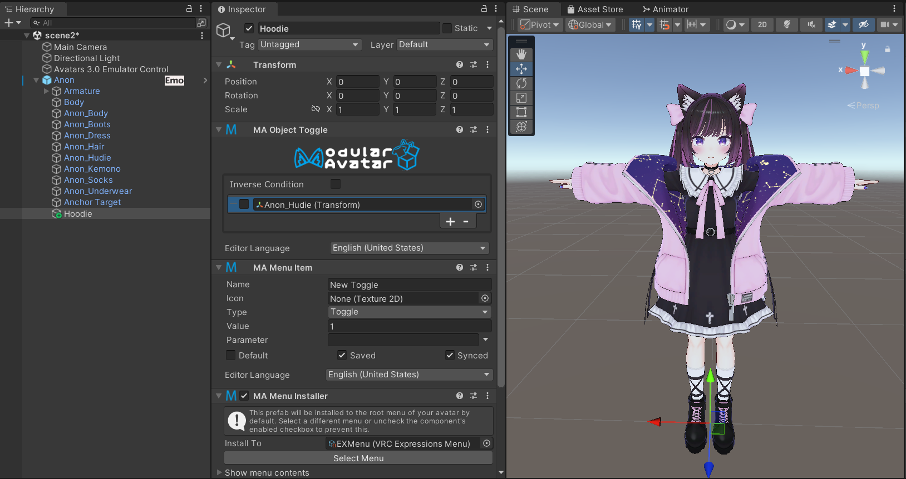

# 簡単なON/OFFトグル設定

このチュートリアルでは、Modular Avatar の Reactive Object システムを使用してオブジェクトをON/OFFする簡単なメニューアイテムを作成します。

Anon-chan のフードをON/OFFしてみましょう。

まず、アバターを右クリックし、`Modular Avatar -> Create Toggle` を選択します。

すると、新しい GameObject がアバターの子として作成され、`Menu Item`、`Menu Installer`、`Object Toggle` コンポーネントが含まれます。

`Object Toggle` で、`+` ボタンをクリックして新しいエントリを追加します。トグルしたいオブジェクトを空の欄にドラッグします。
このメニューアイテムでフードをOFFにしたいので、チェックボックスは空のままにします。

これで設定完了です！トグルを試すには、メニューアイテムの `Default` ボックスをクリックしてください。フードが消えます。

