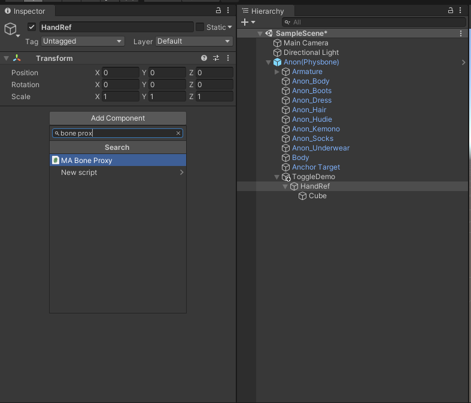
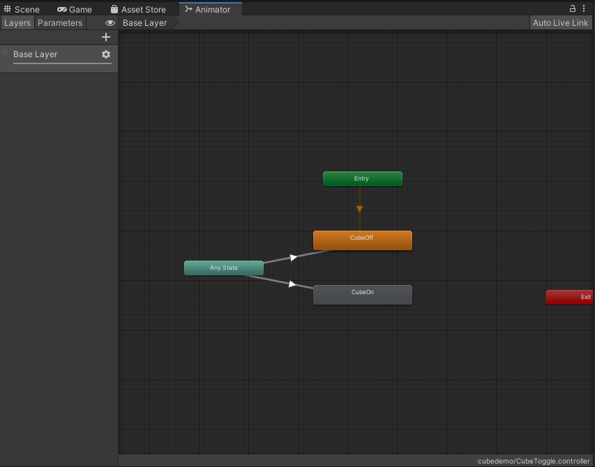
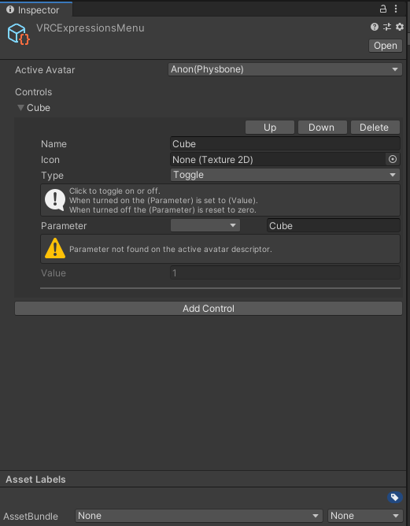

# 手動でアニメーター作成

このチュートリアルでは、手動でアニメーターを組むことでキューブを出したり消したりするプレハブを作ります。
ついでに分かりやすいように、アバターの右手に追従させます。

## ①　オブジェクトを作成

まずは表示するGameObjectを作ります。適当なテストアバターをシーンにおいて、プレハブのルートとなる空のGameObjectを追加します（`ToggleDemo`
と命名します）
このGameObjectの中に、手の追従に使う`HandRef`オブジェクトを作り、さらにその中にキューブを作ります。

### キューブを手に

次はHandRefを右手に追従させます。`HandRef`を選択肢、`Add Component`から`MA Bone Proxy`を追加します。

アバターの右手ボーンを「ターゲット」において、配置モードを「子として・ルートに配置」にします。すると、キューブがアバターの手に移動します。

邪魔にならないようにキューブの位置や大きさを調整しましょう。キューブからBox Colliderを消すのもお忘れなく！

## ②　アニメーターコントローラーを作成

次はキューブの表示状態を制御するアニメーターコントローラーを作成します。
Animator Controllerアセットを作成し、アニメーションクリップを二つ作成します（`CubeOff`と`CubeOn`）。クリップをコントローラーに追加します。
`Any State`に右クリックし、Add TransitionでCubeOffとCubeOnにつなげます。

### トランジションを設定

`Cube`というboolパラメーターを追加します。そして、各トランジションで、Transition Durationを0にして、
Can Transition To Selfをオフにします。Cubeパラメーターをコンディションに追加し、CubeOffの方は条件をfalseにします。

## ③ Merge Animatorの設定とアニメーションの作成

一番上の`ToggleDemo`オブジェクトに戻って、`MA Merge Animator`のコンポーネントを追加します。
`統合されるアニメーター`に先ほど作成したアニメーターを設定します。そして、`付属アニメーターを削除`
と`アバターのWrite Defaults設定に合わせる`をオンにします。

そして、さらにAnimatorコンポーネントを追加し、同じアニメーターコントローラーを設定します。

:::tip

Merge Animatorは必ずしも一番上に配置する必要がありません。お好みに応じてより埋まった場所においてもいいでしょう。
ただし、この後解説する`MA Parameters`コンポーネントが必ず、すべての`Merge Animator`や`Menu Installers`の
同オブジェクトもしくは親（や親の親など）に配置する必要があります。

また、ここでAnimatorを追加するのが絶対必要というわけではありません。Unityのアニメーション録画UIが使える裏技としておいているだけです。
`付属アニメーターを削除`を入れることで、このアニメーターがビルド時に削除されます。

:::

## ④　アニメーションの録画

UnityのAnimationタブへ行きましょう。見当たらないなら、Ctrl-6で開けます。
アニメーションのリストに、CubeOffとCubeOnだけが載っているはずです。見えてない場合は`ToggleDemo`のオブジェクトを選択しましょう。

`CubeOff`を選択した状態で、赤い録画ボタンを押して、`Cube`のGameObjectをオフにします。

そして、`CubeOn`を選択した状態で、赤い録画ボタンを押して、`Cube`のGameObjectを一回オフにしてからオンにします。

## ⑤　同期パラメーターの設定

もう少しです！次は同期パラメーターが自動的に追加されるように設定します。

`ToggleDemo`オブジェクトに戻って、`MA Parameters`コンポーネントを追加します。
`プレハブ開発者向け設定を表示`をONにすると、`Cube`のパラメーターが自動的に追加されているのが分かります。
同期モードをBoolにして、内部値をONにします。

:::tip

内部値のチェックを入れると、Cubeのパラメーターが同じパラメーター名を使っている他のアセットと干渉しないように処理されます。
チェックを入れない場合は、エンドユーザーが自由に名前を変えることができたり、あえて複数のプレハブを干渉させるように設定して、連動する動きが作れるようになります。

:::

## ⑥　メニューを作成しましょう

最後にアバター3.0のメニューを作成します。Expressions Menuアセットを作成します：

Controlを一つ追加します。名前をCubeにして、TypeをToggleにして、そしてパラメーターの方は右側の入力欄で`Cube`打ち込みます。
アバターはまだビルドされないので同期パラメーターが存在せず、ドロップダウンに入っていませんが、問題ないです！

次は`ToggleDemo`のオブジェクトに`MA Menu Installer`コンポーネントを追加します。`プレハブ開発者向け設定`を開き、
先ほど作成したメニューアセットを設定します。

設定終わりです！ここでアバターをビルドしアップロードすると、右手にキューブを出現させるスイッチがアバターのメニューに追加されているはずです。

## 仕上げ：プレハブ変換とコンポーネント順

配布できるように準備しましょう。まず、エンドユーザーが最も操作しそうなコンポーネントはMenu
Installerと（内部値に設定してなければ）Parametersなので、
そちらを一番上にドラッグしましょう。

仕上げに満足したら、ToggleDemoをプロジェクトパネルにドラッグし、プレハブを作成します。どのアバターでもポンと置いただけで追加できるトグルキューブの出来上がりです！