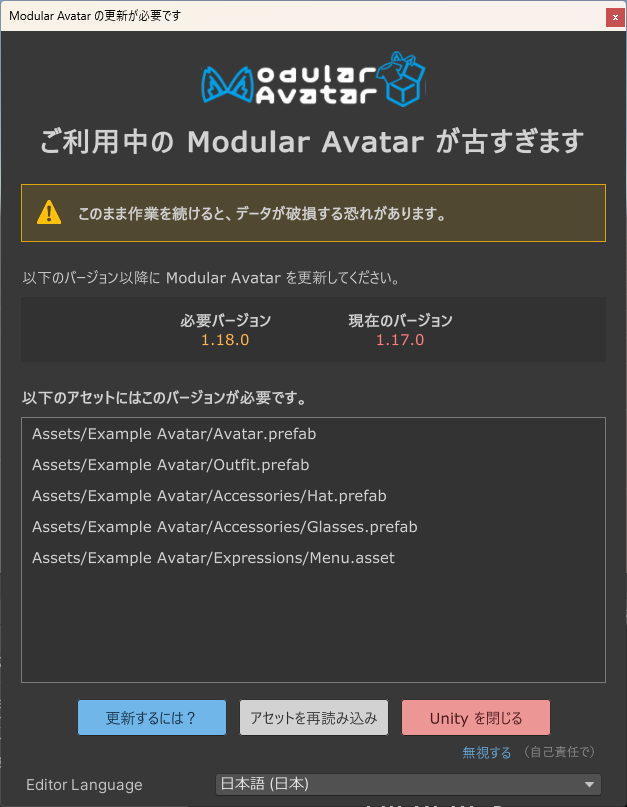
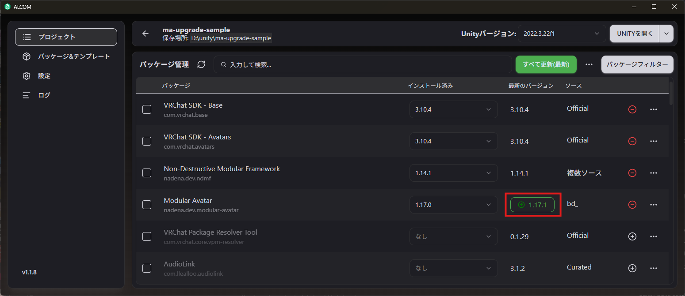
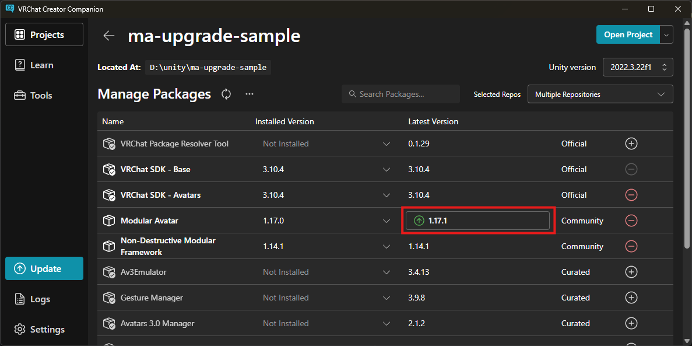

---
sidebar_position: 8
---

# 更新するには？

このページを見ているということは、このようなメッセージが表示されたかもしれません。

シーンに、自分が使用しているより新しい Modular Avatar で制作されたアセットが含まれていることを意味します。
そのアセットは、使用中の Modular Avatar で正しく動作しない可能性があります。

:::warning

この注意が出た状態で、アセットやシーンを編集し保存してしまうと、新しい Modular Avatar で追加された設定情報が欠落される
恐れがあります。この注意が出たら、一旦作業を止めて更新することをお勧めします。

:::

## ALCOM

ALCOM を使って更新することをお勧めします。プロジェクトリストの「管理」ボタンを押して、Modular Avatar の隣のバージョン
ボタンを押すと更新できます。

## VRChat Creator Companion

VRChat Creator Companion を使っている場合は、プロジェクトの「Manage Project」ボタンを押して、Modular Avatar の隣のバージョン
表示ボタンを押すと更新できます。

## 更新後

ALCOM または VCC で更新したあとは、「アセットを再読み込み」を押してください。Unity が新しい Modular Avatar を読み込んで、
正しく更新されているならば注意表示が消えます。

## バージョン不一致注意を強制的に解除する方法

まれに、アセットを古い Modular Avatar で利用できるように調整したい場合があります。
本来、古いバージョンに使う想定なら、そのバージョンで制作するのがベストですが、それができずバージョン注意を解除したい場合は
この手順を使ってください。

1. まずは、ダウングレード用のプロジェクトを作成し、利用想定の Modular Avatar バージョンを導入してください。
  - 1.18.0 より前のバージョンを想定している場合は、一旦 1.18.0 を導入してください。
2. バージョン不一致注意が出た場合は「無視する」を押してください
3. プレハブまたはシーン内の GameObject を右クリックし、「Modular Avatar -> Reset version information」を選択してください。
  「必要なバージョンを現在のバージョンに設定」または、1.18.0 より前のバージョンを想定する場合は「必要なバージョン情報を消去」を押してください。
4. プレハブや GameObject の動作確認を行ってください。
5. 1.18.0 より前のバージョンを想定する場合は、そのバージョンにダウングレードし、動作確認してください。
6. 最後に、更新したアセットをまた最新版 Modular Avatar のプロジェクトに導入し、再度動作確認してください。
