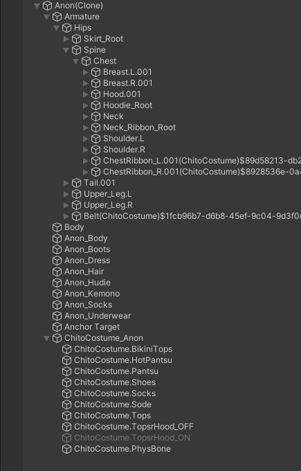
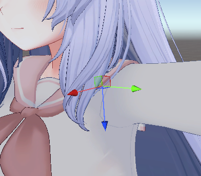

# 给衣装创作者的建议

此页面旨在为希望自己的衣装与 Modular Avatar 兼容的创作者们，提供所需的知识。通常，Modular Avatar 的设计会契合现有衣装的制作惯例，但偶尔也会遇到一些偏离常规的。此页面总结了 Modular Avatar 的预期设计和实现兼容性的详细要求。

## 忙碌人士的快速摘要

如果你想制作“Modular Avatar 兼容”的衣装，请确保“Setup Outfit”能够正常运行。
如果你想制作“Modular Avatar 预设”的衣装，请预先运行“Setup Outfit”。此外，还可以考虑以下配置：

- **Blendshape Sync**（根据素体体型变化，自动调整衣装的 Blendshape）
- **Shape Changer**（根据衣装的启用/禁用状态，自动缩小或隐藏素体的一部分）
- **Menu Item** 和 **Object Toggle**（允许用户开启/关闭衣装的特定部分）

---

## “兼容”与“预设”

在开始之前，我们需要明确 Modular Avatar 的衣装支持分为两个级别。
最低限度，你可以确保骨骼命名规则和 **PhysBones** 组件的放置与 Modular Avatar 的预期兼容，这被称为“Modular Avatar 兼容”衣装。大多数衣装自然会兼容，但如果你遇到问题，可以参考本文档的详细要求。

“Modular Avatar 兼容”的衣装不包含任何 Modular Avatar 组件，因此你无需使用 Modular Avatar 来安装它们，也可以使用其他衣装安装系统（当然也可以手动操作）。

更进一步，你可以提供一个已经配置好 Modular Avatar 组件的预制件，我们称之为“Modular Avatar 预设”。这能为你的客户提供各种便捷功能和技巧，简化设置步骤，减少出错的风险。例如，你可以设置 Blendshape 自动与素体同步，以及隐藏被衣服遮盖的素体部分。不过，这要求你的客户必须安装 Modular Avatar。你也可以准备多个预制件，一个包含 Modular Avatar 组件，另一个不包含，以满足不同用户的需求。

请注意，“Modular Avatar 兼容”的衣装不能使用 Modular Avatar 的标志。详细信息请参考[Logo使用指南**](../logo-usage.md)。

---

## 兼容性确认与调试提示

在深入细节之前，我们先来看一下安装“Modular Avatar 兼容”衣装的典型工作流程。大多数用户会将衣装放入 Avatar 的 **Game Object** 中，然后右键选择 `Modular Avatar -> Setup Outfit`。如果成功，所需的 Modular Avatar 组件将被添加，Avatar 就可以使用了。

要确认设置是否正确，有几种方法：

### 编辑模式下的姿势同步

运行 **Setup Outfit** 后，衣装在编辑模式下会与素体的骨骼姿势同步。你可以旋转几个素体骨骼，看看衣装是否正确跟随。

### 播放模式下的确认

Modular Avatar 会在播放模式下合并 Avatar，你可以在此预览最终上传时的效果。使用 **Avatar 3.0 Emulator** 或 **Gesture Manager** 等工具可以获得更精确的预览。

### 手动烘焙 (Manual Bake)

你也可以在编辑模式下直接处理 Avatar 并显示结果。只需右键点击 Avatar，选择 `Modular Avatar -> Manual Bake Avatar`。系统会创建一个已应用衣装的 Avatar 克隆体，你可以在其中检查最终效果。

---

## Setup Outfit

### 它是如何工作的？

**Setup Outfit** 的设计宗旨是识别大多数现有衣装，并进行基本设置。让我们详细看看它的工作原理。

#### 骨骼识别

  
*圈出的部分是 Setup Outfit 用于比较和识别衣装骨骼的方式。*

**Setup Outfit** 首先会在衣装中寻找特定的骨骼，并将其作为处理的基准点。具体来说，它会寻找类似 `OutfitRoot -> [Armature] -> Hips` 的骨骼。这里的 `Hips` 必须包含素体臀部骨骼的名称。臀部骨骼名称前后可以有任何额外文本，但所有骨骼都必须保持一致。此外，`Armature` 游戏对象的名称可以是任意的。

如果衣装的骨骼命名不符合这些规则，**Setup Outfit** 会尝试将衣装和素体的骨骼名与一个通用骨骼名列表进行匹配，如果成功，它会将衣装的骨骼名重命名以匹配素体。这种方式的稳定性不如精确命名匹配，因此建议尽量让骨骼名称精确匹配。

#### T-pose/A-pose 转换

  

有时，衣装和素体的姿势不一致。比如素体是 T-pose，但衣装是 A-pose。**Setup Outfit** 会以骨骼位置为基准，旋转手臂来匹配姿势。

#### 创建 Merge Armature 组件

  

**Setup Outfit** 会在 Armature 对象上创建一个 **Merge Armature** 组件。这个组件包含了骨骼名前后的文本（前缀和后缀）以及对素体骨骼的引用。这个组件实际上就是将衣装的骨骼合并到 Avatar 骨骼中的核心。

如果衣装中存在素体没有的 **Upper Chest** 骨骼，**Setup Outfit** 会使用多个 **Merge Armature** 组件来处理这种情况。

**Merge Armature** 会尽量避免骨骼重复，尽可能将衣装骨骼合并到素体中。不过，包含 **Transform** 以外组件的骨骼不会被合并，而是会作为素体对应骨骼的子对象被移动。

#### 创建 Mesh Settings 组件

  

**Setup Outfit** 还会自动创建一个 **Mesh Settings** 组件。这会将衣装中所有网格的 **Light Probe Anchor** 设置得与素体保持一致，并提供合理的包围盒设置。

### 处理前与处理后

以下是 **Manual Bake** 处理前后的示例：

  
  *处理前*

  
  *处理后*

如你所见，大部分衣装骨骼都已合并，但由于 **PhysBones** 的配置，一些骨骼得以保留。素体中不存在的骨骼也会被保留。每个骨骼名称后添加的文本用于避免在添加多个衣装时发生名称冲突。

### 动画修正

**Merge Armature** 会对 Avatar 中的动画进行多项调整。具体来说，它会：

- 调整动画路径以匹配移动后的骨骼。
- 如果存在开关整个衣装的动画，它会调整这些动画，使其能够开关所有分散在 Avatar 各处的衣装对象。

这意味着用户通常只需使用任何喜欢的动画设置工具来开关衣装的根对象，系统会自动开关网格和所有 **PhysBones** 组件。

### 与 Bone Proxy 的区别

如果你熟悉 **Bone Proxy**，可能会想知道它和 **Merge Armature** 有什么不同。它们的区别如下：

- **Bone Proxy** 不会合并骨骼，它只是将一个对象移动到 Avatar 中另一个对象下。
- 如果你将 **Bone Proxy** 的目标设为一个人形骨骼，它的引用方式不依赖于骨骼名称。这使得你可以创建适用于任何 Avatar 的通用小工具。
- **Bone Proxy** 允许你选择如何处理对象的位置和旋转，例如，它可以让一个对象跟随手的位置，无论手在何处。
- **Bone Proxy** 不会像 **Merge Armature** 那样调整开关动画。虽然它会修正动画路径，但开关父对象的动画不会影响 **Bone Proxy** 对象及其子对象。

**Bone Proxy** 在创建只针对单个骨骼的配件时很有用。例如，发夹可以使用一个锁定在头部骨骼的 **Bone Proxy**。这使得它比原始设置更易于在不同 Avatar 上使用。

### 允许的设计

**Setup Outfit** 和 **Merge Armature** 支持一些可能令人意外的设计。以下是一些例子。

#### 骨骼名称的前缀和后缀

如前所述，你可以在骨骼名称前后添加前缀或后缀。只要所有要合并的骨骼都使用完全相同的前缀或后缀，这是可以的。不使用相同前缀或后缀的骨骼将不会与素体骨骼合并。注意，大小写在此处很重要。

#### 骨骼轴向不同

  
  *素体的肩骨*

  
  *衣装的肩骨*

不同的 3D 建模软件可能使用不同的轴向约定；有时 X 轴从肩部伸出，有时是 Y 或 Z。Merge Armature 会自动处理这个问题；只要位置匹配，就不需要匹配素体的旋转。

#### Armature 对象的命名

事实上，**Setup Outfit** 并不关心 `Armature` 对象（臀部骨骼的父对象）的名称。它只寻找衣装的臀部骨骼。

#### A/T 姿势转换

衣装的摆臂姿势与素体不同也是可以的。如果你这样做，有几个重要注意事项：

- A/T 姿势转换只会在你的手臂长度与素体完全一致时发生。如果长度相差超过微小量，转换将被跳过。
- **Setup Outfit** 根据骨骼位置的差异来确定旋转方向。因此，如果你的骨骼位置略有偏差，可能会导致不希望的旋转。

### 避免的设计

#### 在人形骨骼上使用 PhysBones

有些衣装在臀部或胸部等人形骨骼上附加了 **VRC PhysBones** 组件。这并不推荐；虽然在某些情况下可以工作，但许多衣装会不小心从素体上复制 **PhysBones**，而 Modular Avatar 此时会尝试删除这些组件。这可能导致不可预测的行为。

建议的做法是，确保所有 **PhysBones** 组件都位于素体中不存在的 **GameObjects** 上，或者位于 **Merge Armature** 组件的游戏对象之外。这样可以确保行为的一致性。

#### 与素体完全相同的命名

如果你的所有骨骼以及 **Armature** 对象的名称与素体完全相同，可能会触发一些烦人的 Unity Bug。为了避免这种情况，**Setup Outfit** 会通过在 **Armature** 对象的名称后添加 `.1` 来重命名它。然而，最好从一开始就避免这种情况；重命名 **Armature** 对象或臀部对象都可以避免这些问题。

---

## Modular Avatar 预设衣装

现在我们已经讨论了支持 Modular Avatar 的最低要求，接下来谈谈“Modular Avatar 预设”衣装意味着什么。这通常意味着你已准备好一个已运行 **Setup Outfit** 的预制件。你的客户只需将此预制件添加到他们的 Avatar 中，衣装便可立即使用。如果他们再次运行 **Setup Outfit**，系统会识别出已配置，并跳过处理。

以这种方式配置的衣装可能有资格在宣传中使用 Modular Avatar 的标志。详细要求请参阅[Logo使用指南](../logo-usage.md)。

你还可以更进一步，设置其他功能以让客户使用更方便。以下是一些例子。

### Blendshape 同步

有些 Avatar 包含改变身体各部分大小的 Blendshape。你可以使用 [Blendshape Sync](../../reference/blendshape-sync.md) 组件，自动调整衣装的 Blendshape 以匹配素体。例如，这对于胸部大小的 Blendshape 很有用。

### 缩放/隐藏形状键

许多 Avatar 都有可用于缩小和隐藏素体部分以避免穿模的形状键。Modular Avatar 具有一个功能可以自动化这个过程。通过配置 [Shape Changer](../../reference/reaction/shape-changer.md) 组件，Modular Avatar 会在对应的对象启用时自动缩小或隐藏形状键。这也会响应开关衣装部分的动画，并且如果 **Shape Changer** 对象始终启用，甚至可以直接删除部分网格。

### 对象开关 (Object Toggles)

许多衣装有可以开启和关闭的不同部分。你可以通过预先配置 `Object Toggle` 来为用户设置一个菜单。有关如何设置这些的详细信息，请参阅[Object Toggle 教程](../../tutorials/object_toggle/index.md)。

然后，你可以将这些组合到一个子菜单中。为此，在你的开关父对象上设置一个类似这样的对象：

