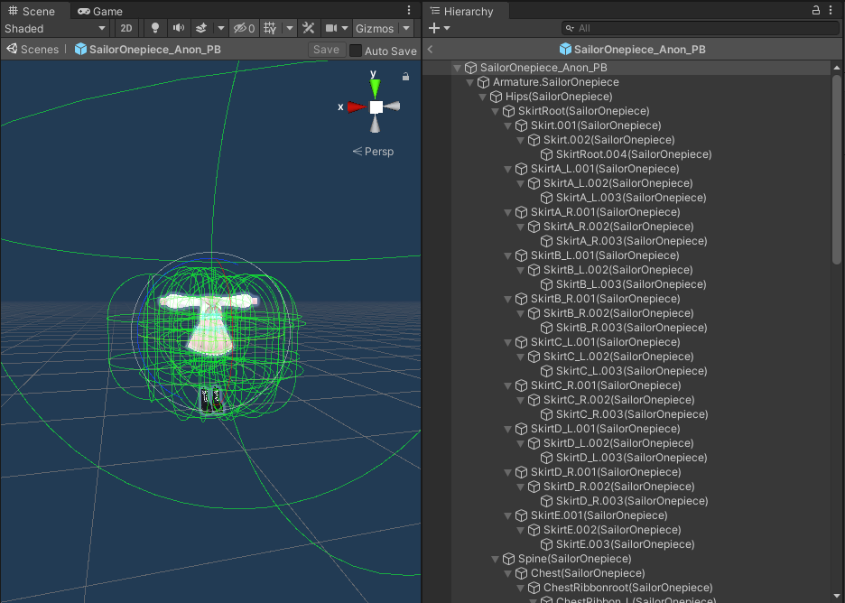

import ReactPlayer from 'react-player'

# 分发预制件

Modular Avatar 的设计旨在帮助资产创作者，允许他们分发只需拖放即可安装的预制件。
本页总结了使用 Modular Avatar 分发预制件的一些建议。

## 引导用户前往 Modular Avatar 的官方分发页面

许可证允许在你的资产中附带一份 Modular Avatar 的副本。但是，这可能导致用户安装非常旧的版本，甚至意外降级并破坏他们的其他预制件。因此，强烈建议你引导用户从 [Modular Avatar 的官方分发页面](https://github.com/bdunderscore/modular-avatar/releases)下载。

未来，我们计划实现一种基于 VCC 的简易安装方法。这需要等待 VCC 本身的改进和功能更新，但会让安装变得更加简单。

## 若要兼容非 Modular Avatar 环境，请善用嵌套预制件

如果你在预制件中添加了 Modular Avatar 组件，用户在未安装 Modular Avatar 的情况下将无法使用该预制件。
有些用户可能因某些原因不想使用 Modular Avatar，如果你想支持这些用户，可以使用嵌套预制件将衣装本身与 Modular Avatar 配置分开。

如果你不熟悉嵌套预制件，可以按照以下步骤操作：

1. 像平常一样创建你的衣装预制件。
2. 在预制件模式下打开它（在项目窗口中双击）。
   
3. 将预制件的根对象拖放到项目窗口中。当出现确认窗口时，点击 **Create Base**。给新创建的文件起一个易于识别的名称（例如，“衣装_无MA”）。
   <ReactPlayer playing muted loop playsinline url='/img/creating-base.mp4' />

完成后，你可以在原始预制件上设置 Modular Avatar 组件，并将其他设置应用到新创建的“基础预制件”上。使用 Prefab Overrides 菜单，可以轻松将你在场景中进行的调整分配到不同的预制件上。

## 动画资产请使用内部参数

使用**内部参数**可以帮助避免与其他资产发生冲突。内部参数在构建时会自动重命名为唯一的名称，确保不会有名称冲突。