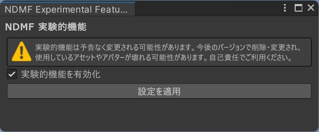

# 实验性功能

Modular Avatar（以及 NDMF）包含了一些默认禁用的实验性功能。
这些功能仍在积极开发中，其行为将来可能会改变。
它们可能尚未完全被文档化。

:::warning

实验性功能可能会以不向后兼容的方式进行更改。
这意味着如果你使用实验性功能，将来可能需要更新你的Avatar或资产才能使其继续工作。

:::

## 启用实验性功能

在启用实验性功能之前，请确保你安装了最新（beta）版本的 Modular Avatar 和 NDMF。详细信息请参阅 [安装说明](intro#betas)。

要启用实验性功能，请在菜单栏中打开“Tools” -> “NDM Framework” -> “Experimental Features”。这将打开一个窗口，你可以在其中启用或禁用实验性功能。

## 实验性功能列表

- [Resonite 支持](./resonite-support.md)
- [通用型Avatar组件](./portable-avatar-components.md)