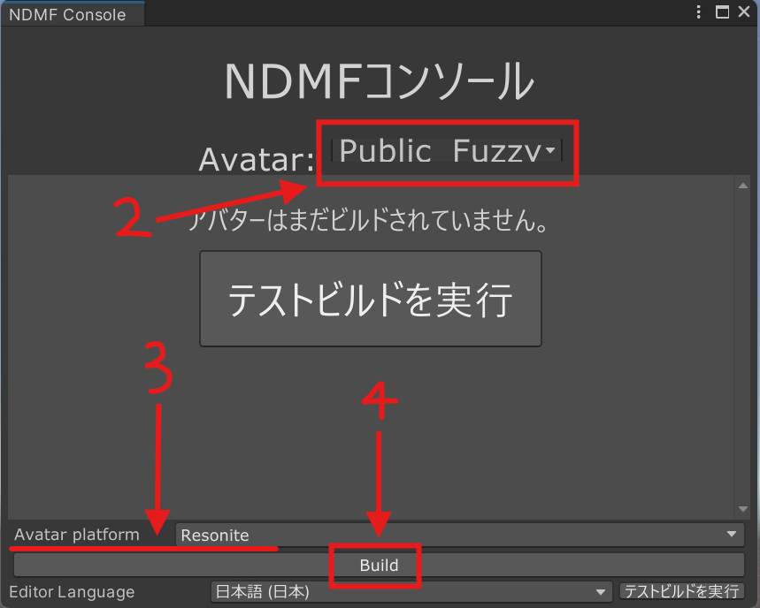

# Resonite 支持

Modular Avatar 提供了对 Resonite Avatar构建的实验性支持。

## 入门和首次Avatar构建

### 安装 Modular Avatar - Resonite support

构建 Resonite Avatar需要安装 VCC 包 `Modular Avatar - Resonite support`。要安装此包：

1. 请参阅 [安装](intro.md) 指南，添加预发布版本仓库。
2. 然后，打开项目的“管理”窗口，点击 `Modular Avatar - Resonite support` 旁边的 `+`，然后点击“应用”。

安装后，请**启用实验性功能支持**。

## 构建

按照以下步骤为 Resonite 构建Avatar：

1. 打开 NDMF 控制台（Tools -> NDM Framework -> NDMF Console）。
2. 在窗口顶部选择你的Avatar。
3. 在窗口底部的“Avatar platform”下选择“Resonite”。
4. 点击 **Build**。

当构建成功完成时，NDMF Console 的底部会显示“Build finished!”的消息。

:::tip

如果出现错误，请点击 `Console` 选项卡，查看底部是否有**红色的感叹号**。

:::

构建完成后，将其安装到 Resonite 中。有两种安装方法：

1. 点击“Copy to Clipboard”，然后从 Resonite 的仪表板菜单中点击“从剪贴板粘贴内容”。
2. 点击“Save as...”，将Avatar文件保存为 Resonite Package，然后将其拖放到 Resonite 中。

## 支持的功能

Resonite 构建过程会在构建时自动复制Avatar的某些特定功能，例如口型同步、眼睛位置和物理骨骼/动态骨骼。
如果你的Avatar已经为 VRChat 设置好，则无需额外配置。如果你的Avatar没有为 VRChat 设置，或者没有安装 VRCSDK，请参阅 **[通用型Avatar组件](portable-avatar-components.md)** 的文档，以了解如何设置你的Avatar。

| 功能 | 支持情况 | 限制 |
| --- | --- | --- |
| Avatar视点 | ✅ | 无 |
| 口型同步 | 部分支持 | 仅限 Blendshape 口型同步 |
| 动态骨骼 | 部分支持 | 见下文 |
| 反应式组件 | ⌛ | 计划中 |
| Unity 约束 | ⌛ | 计划中 |
| 防止加载中显示部分Avatar | ✅ | 无 |

## 支持的 MA 组件

| 组件 | 支持情况 | 限制 |
| --- | --- | --- |
| Blendshape Sync | ⌛ | 计划中 |
| Bone Proxy | ✅ | 无 |
| Convert Constraints | ✖ | 仅限 VRChat |
| Menu Group | ⌛ | 计划中 |
| Menu Install Target | ⌛ | 计划中 |
| Menu Installer | ⌛ | 计划中 |
| Menu Item | ⌛ | 计划中 |
| Merge Animator | ✖ | 仅限 VRChat |
| Merge Armature | ✅ | 无 |
| Merge Blend Tree | ✖ | 仅限 VRChat |
| Mesh Settings | ⌛ | 计划中 |
| MMD Layer Control | ✖ | 仅限 VRChat |
| Move Independently | ✅ | 无 |
| Parameters | ⌛ | 计划中（将转换为 DynVars） |
| Physbone Blocker | ✅ | 无 |
| Remove Vertex Color | ✅ | 无 |
| Replace Object | ✅ | 无 |
| Scale Adjuster | ✅ | 无 |
| Sync Parameter Sequence | ✖ | 仅限 VRChat |
| Visible Head Accessory | ⌛ | 计划中 |
| VRChat Settings | ✖ | 仅限 VRChat |
| World Fixed Object | ⌛ | 计划中 |
| World Scale Object | ⌛ | 计划中 |

## 关于动态骨骼

Modular Avatar 会检测使用 **[便携式动态骨骼](portable-avatar-components.md#portable-dynamic-bones)** 或 VRChat 的 **PhysBones** 创建的动态骨骼，并尝试将其转换为 Resonite 的动态骨骼，包括所有碰撞体。

由于 Resonite 有自己的动态骨骼系统，大多数配置选项不会被转换。但排除列表（包括 **Physbone Blocker**）、碰撞体、碰撞半径和可抓取性会被转换。

Modular Avatar 会根据骨骼名称将动态骨骼分组到一些命名好的“模板”中。你可以在便携式动态骨骼组件中指定组名来覆盖模板名称。
或者，在 Resonite 中，你可以通过克隆 `Avatar Settings` -> `Dynamic Bone Settings` 插槽下的对象，将其名称设置为新的模板名称，然后更改定义动态骨骼的插槽下的 `Template Name` 插槽名称来创建新模板。

同一模板下的所有动态骨骼将共享 **Inertia**、**InertiaForce**、**Damping**、**Elasticity** 和 **Stiffness** 的相同设置；你可以在任何一个动态骨骼上更改这些设置，更改将反映在所有属于该模板的动态骨骼上。

## Avatar设置的复制功能

Modular Avatar 会自动导入一个系统，用于在不同版本的 Resonite Avatar之间复制Avatar设置。这使你可以设置 Resonite 专属设置（例如动态骨骼设置），然后在从 Unity 重新导入后将它们复制到新版本的Avatar上。

具体来说，此功能会复制 `Avatar Settings` 插槽下的所有插槽，并覆盖任何具有相同名称的现有插槽。你也可以将自己的插槽添加到 `Avatar Settings` 插槽，它们也会被复制。

要复制设置，请在 Resonite 中穿戴你的旧Avatar，并用激光拾取你的新Avatar。从上下文菜单中选择 `MA Settings Copier` -> `Copy To Avatar`。这会将旧Avatar的设置复制到新Avatar上。然后你可以穿戴新Avatar，设置就会被应用。

## 自动定义的 DynVar

Modular Avatar 定义了一些可供Avatar系统使用的默认动态变量（Dynamic Variables）。

其中一些 DynVar 仍处于实验阶段，未来可能会发生变化。

| 名称 | 类型 | 描述 |
| --- | --- | --- |
| `modular_avatar/AvatarRoot` | `Slot` | Avatar的根插槽（`CenteredRoot` 的父对象） |
| `modular_avatar/AvatarWorn` | `bool` | Avatar是否正在被穿戴（通过Avatar是 User 插槽的直接子对象来检测） |
| `modular_avatar/AvatarSettingsRoot` | `Slot` | `Avatar Settings` 对象 |
| `modular_avatar/AvatarPoseNode.[type]` | `Slot` | 包含 `AvatarPoseNode` 组件的插槽，用于节点 `[type]`（例如 `Head Proxy`） |
| `modular_avatar/MeshNotLoaded` | `bool` | 如果Avatar中有未加载的网格，则为 `False`；否则为 `missing`。**此 DynVar 未来可能会更改**。 |
| `modular_avatar/HumanBone.[name]` | `Slot` | 按名称引用人形骨骼。**名称将来可能会更改**。 |
| `modular_avatar/HumanBonePose.[name]` | `float4x4` | 引用骨骼的初始姿势。**名称和内容将来可能会更改**。 |

此外，系统会在Avatar根部为其他小工具创建一个 `Avatar` Dynamic Variable Space。