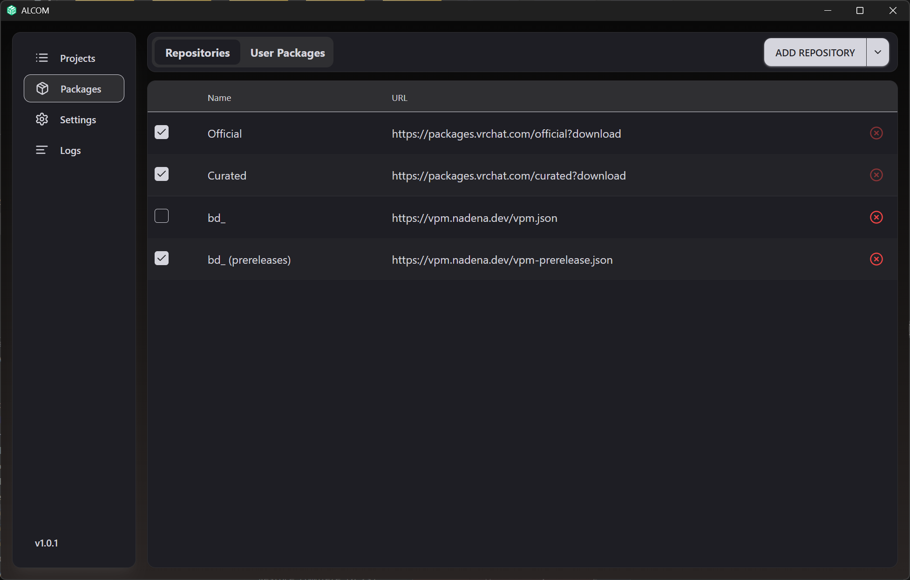
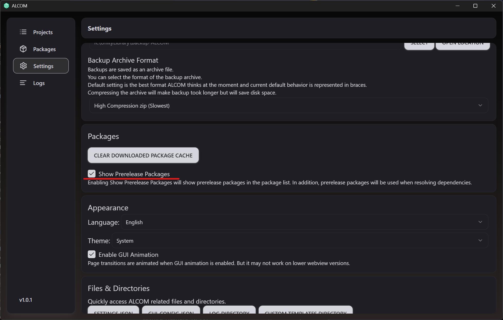
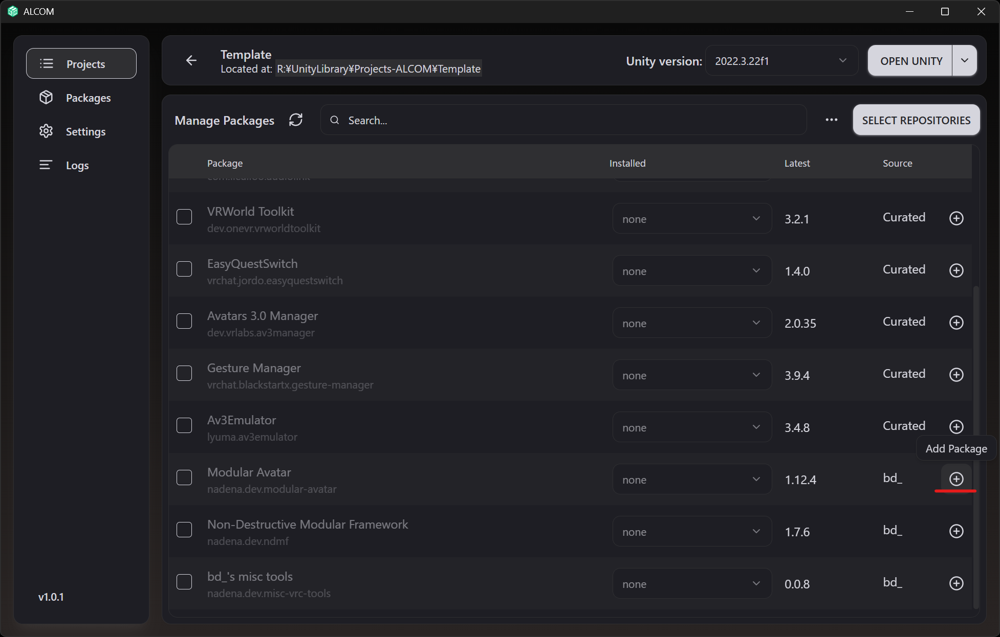
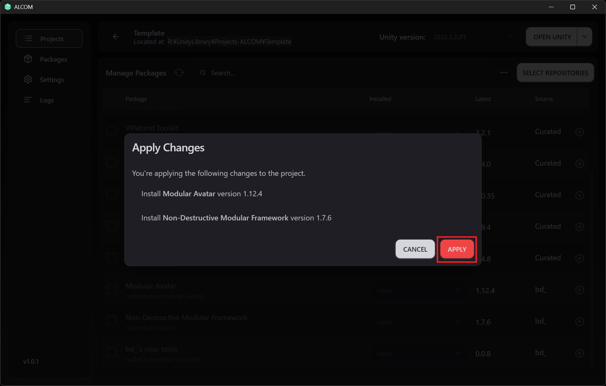
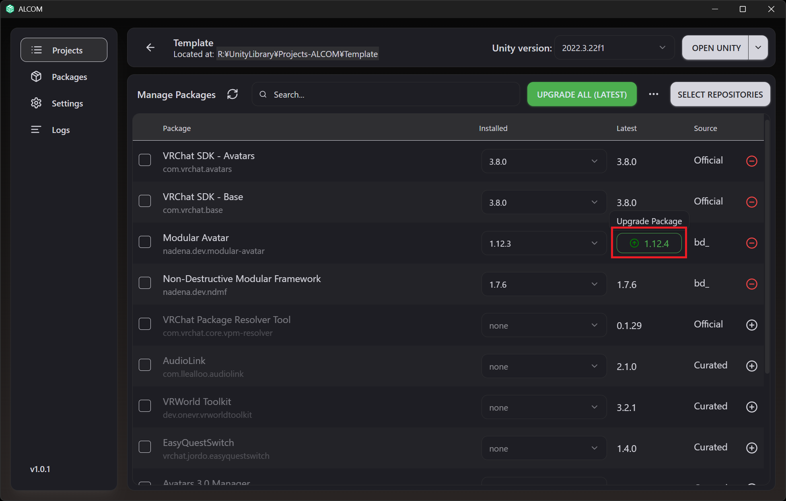
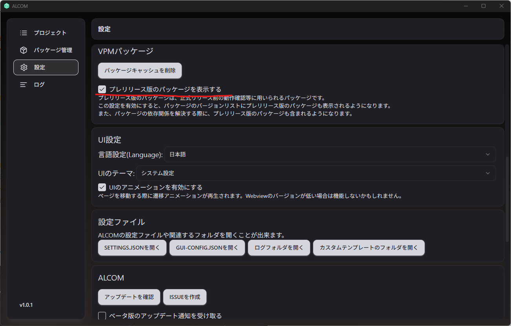

import Tabs from '@theme/Tabs';
import TabItem from '@theme/TabItem';

# Modular Avatar

Modular Avatar 是一个用于模块化你的虚拟形象和分发虚拟形象组件的**非破坏性**工具套件。
使用 Modular Avatar，为你的虚拟形象添加新的服装或小工具就像拖放一样简单！

Modular Avatar 的功能以单独的组件形式提供，你可以根据需要添加。你可以选择只使用你想要的功能。它可以自动将衣装合并到你的虚拟形象上，从多个组件构建动画控制器等等。

## 安装

推荐使用 ALCOM 安装 Modular Avatar。也支持使用 VRChat Creator Companion 进行安装。

<Tabs>
<TabItem value="ALCOM" label="ALCOM" default>

首先请安装 [ALCOM](https://vrc-get.anatawa12.com/ja/alcom/)。

安装后，请按照以下步骤添加 VPM 仓库：

* “Packages”（包管理） -> “Add Repository”（添加仓库）
* 在 “Enter information about the repository”（输入仓库信息）中输入以下值，然后点击 “Add Repository”（添加仓库）：
    * 稳定版: `https://vpm.nadena.dev/vpm.json`
    * 测试版: `https://vpm.nadena.dev/vpm-prerelease.json` (如果使用 Beta 版本)
* 确认显示以下信息，然后点击 “Add VPM Repository”（添加 VPM 仓库）：
    * Repository Name（仓库名）: `bd_`
    * URL: 你输入的 URL

完成后，打开项目的“管理”窗口，点击 Modular Avatar 旁的 `+`，然后点击“应用”。

要更新到最新版本，请点击版本号和绿色箭头所在的区域，然后点击“应用”。

</TabItem>

<TabItem value="VCC" label="VRChat Creator Companion">

如果你想使用 VRChat Creator Companion，请 **[点击此处安装 VCC](https://vrchat.com/home/download)**

安装 VCC 后，点击此处：
* **[将 Modular Avatar 添加到 VCC](vcc://vpm/addRepo?url=https://vpm.nadena.dev/vpm.json)**

然后，前往项目的“管理”窗口，点击 Modular Avatar 旁的 `+`。

要更新到最新版本，只需点击“最新版本”列中的绿色箭头即可。

</TabItem>
</Tabs>

## 预发布版本 {#betas}

:::warning

由于 VCC 依赖项解析存在 Bug，请使用 ALCOM 安装预发布版本。

:::

要在 ALCOM 中使用预发布版本，请在 ALCOM 的“设置”窗口中启用 `显示预发布包`。

预发布版本的分档可以在[这里](https://modular-avatar.nadena.dev/dev)找到。

预发布版本可能包含 Bug，并且随着开发进展，可能会有不兼容的变更。请在 [GitHub 问题页面](https://github.com/bdunderscore/modular-avatar/issues) 留下反馈和 Bug 报告。

## 接下来阅读什么

安装 MA 后，请查看以下教程：

* [简单衣装设置](/docs/tutorials/clothing)
* [复杂衣装设置](/docs/tutorials/adv_clothing)
* [开关对象](/docs/tutorials/object_toggle/)
* [编辑菜单](/docs/tutorials/menu/)