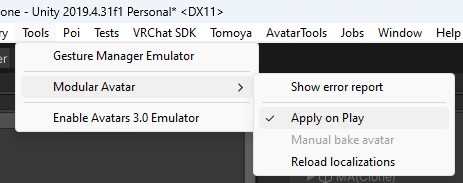

---
sidebar_position: 6
---

# 问题处理

当Avatar处理过程中发生错误时，Modular Avatar 会打开一个错误报告窗口。

你可以点击对象名称以在场景视图中选择该对象。此报告中的大多数错误都会随着你编辑Avatar而自动更新，但某些类型的错误可能需要重新构建。

如果你关闭了错误报告窗口，可以在 Unity 菜单栏中通过 **Tools -> Modular Avatar -> Show Error Report** 重新打开它。

## 常见问题

### 根本没有进行任何处理！

检查 “Apply On Play” 是否被勾选：

