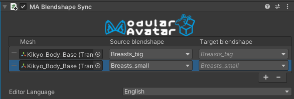
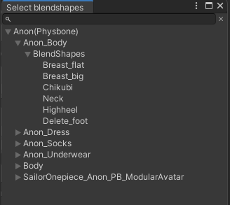

import ReactPlayer from 'react-player'

# Blendshape Sync

**Blendshape Sync** 组件允许你确保一个渲染器上的 Blendshape 始终与另一个渲染器上的 Blendshape 匹配。

<ReactPlayer controls muted loop playsinline url='/img/blendshape-sync.mp4' />

## 我应该何时使用它？

通常，虚拟形象会有 Blendshape 来调整身体形状。如果你正在制作（或使用）一套衣装，而这套衣装也有匹配的形状键，那么 **Blendshape Sync** 就是为你准备的组件！

这对于基础虚拟形象也很有用——可以同步不同对象之间的 Blendshape。

## 我不应该何时使用它？

**Blendshape Sync** 总是从一个渲染器的 Blendshape 复制相同的值到另一个。如果缩放或动画曲线需要不同，它将无法正常工作。

Blendshape Sync 无法链式同步——也就是说，你可以从 A 复制到 B 和从 A 复制到 C，但不能从 A 复制到 B，再从 B 复制到 C。

在运行时，Blendshape Sync 只支持同步由动画控制器控制的 Blendshape。由 VRChat 内置的 EyeLook 或 Viseme 系统直接控制的 Blendshape 无法被精确同步。

## 设置 Blendshape Sync

将 **Blendshape Sync** 组件添加到你的预制件中的一个对象上。然后点击 `+` 按钮打开一个选择窗口。

双击一个 Blendshape 将其添加到同步列表中。添加完所有需要的 Blendshape 后，点击 `X` 关闭编辑窗口。

Blendshape Sync 也支持多选编辑，因此你可以一次选择多个网格进行配置。

如果 Blendshape 的名称不同，你可以在添加后更改目标 Blendshape 的名称。

### 它的具体工作原理是什么？

Blendshape Sync 执行两项任务：

* 在编辑模式下，它会自动从基础对象复制 Blendshape 值，因此对基础对象的形状键所做的更改会立即在其他对象中生效。
* 在播放模式和上传时，它会修改所有动画，使其在动画化基础对象的 Blendshape 时，也同时动画化其他对象的 Blendshape。