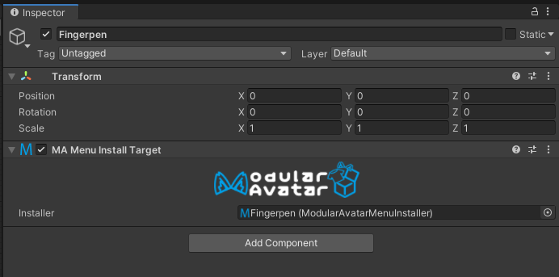

# Menu Install Target

**Menu Install Target** 组件用于支持 [MA Menu Installer](menu-installer.md) 组件上的“选择菜单”按钮。
它从 **MA Menu Installer** 组件中“拉取”菜单，并根据其所附加的游戏对象的位置进行安装。

## 我应该何时使用它？

当你使用 [MA Menu Installer](menu-installer.md) 组件上的“选择菜单”按钮时，Modular Avatar 会在必要时创建此组件。在大多数情况下，无需手动创建它。

## 它的作用是什么？

此组件会覆盖所选菜单安装程序上的目标菜单选项；菜单安装程序将表现得好像其菜单被复制粘贴到了 **Menu Install Target** 的位置。这使得使用 **Menu Installer** 的预制件可以集成到 **[基于对象的菜单系统](/docs/tutorials/menu)** 中。