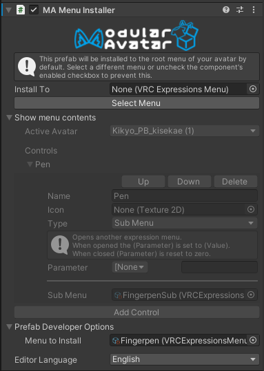

# Menu Installer

Modular Avatar 的 **Menu Installer** 允许你轻松地将菜单项添加到Avatar的表情菜单中。

## 我应该何时使用它？

当你有一个菜单项需要添加时！

## 如何使用它？

### 最终用户

默认情况下，预制件的菜单将安装在你的Avatar动作菜单的顶层。
如果这就是你想要的，那就大功告成！否则，点击“选择菜单”并双击你想要安装预制件控件的菜单。

如果所选菜单已满，它将自动分成多页（子菜单）。

如果你想完全禁用菜单安装，可以点击菜单安装程序检查器左上角的禁用复选框。

### 预制件开发者

首先，使用你想要添加的控件创建一个表情菜单。此菜单将被**附加**到Avatar表情菜单树中选定的子菜单中。
因此，如果你想要一个自己的子菜单，你需要创建两个菜单资产：一个用于子菜单控件，另一个用于内部菜单本身。

将 **Menu Installer** 组件添加到你的预制件中，与你的 **[Parameters](parameters.md)** 组件在同一级别。
然后，打开“预制件开发者选项”标签，将所需的菜单添加到“要安装的菜单”字段中。完成！

### 菜单来源

除了安装预先存在的菜单资产，通过附加 **Menu Item** 或 **Menu Group** 组件，菜单安装程序将根据该组件的配置生成菜单项。

### 扩展其他资产的菜单

在某些情况下，扩展由另一个 **Menu Installer** 组件安装的菜单会很有用。
这可以通过在“安装到”字段中指定由另一个 **Menu Installer** 组件安装的菜单资产（或子菜单）来实现。