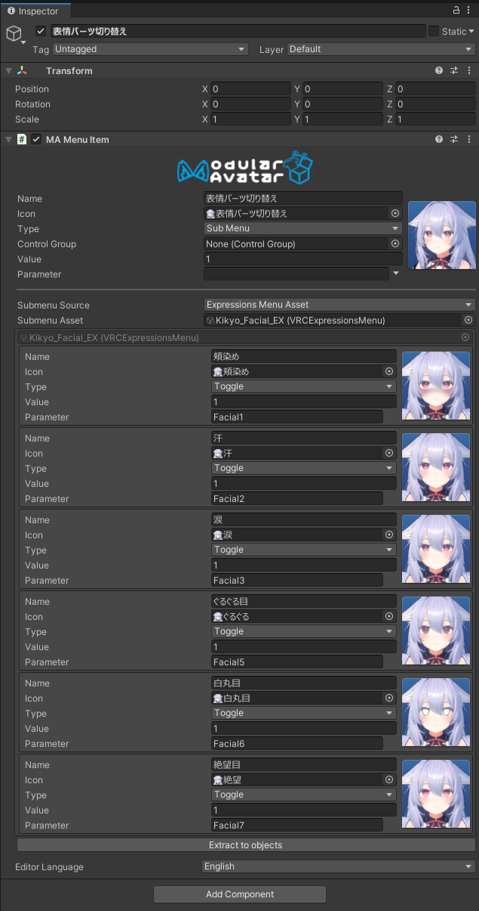
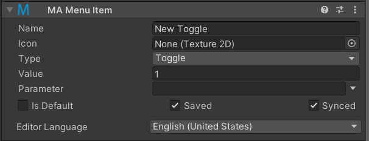

# Menu Item

**Menu Item** 组件允许你在 Unity 的层级结构中定义一个表情菜单项。

## 我应该何时使用它？

这个组件提供了一种比定义传统的 **VRC Expressions Menu** 资产更方便的方式来编辑和定义菜单项。你可以在层级结构中通过拖放来移动菜单项，它还提供了一个能感知 **[MA Parameters](parameters.md)** 组件中定义的参数名称的编辑器界面。

## 如何使用它？

:::tip

关于如何使用菜单编辑器系统的完整教程可在此处找到：**[菜单编辑](/docs/tutorials/menu)**。

:::

**Menu Item** 组件在更大的菜单中定义了一个单一的菜单项。你可以配置菜单项的图标、菜单类型和参数。菜单项的名称将取自包含它的游戏对象的名称。这使你可以在层级结构中直接查看和重命名菜单项。

### 子菜单

当菜单项被设置为子菜单时，你可以配置子菜单的来源。你可以将子菜单来源设置为“表情菜单资产”并配置一个传统的 VRC Expressions Menu 资产来引用，或者将其设置为“子对象”，在这种情况下，附加到此菜单项的直接子对象上的菜单项将被用来填充子菜单。

如果子菜单中的项目数量超过 VRC 菜单的最大项目数，系统将自动创建一个“Next”项目来分页。

当子菜单来源是子对象时，你还可以指定一个“源对象覆盖”。如果设置了，将使用该对象的子对象，而不是菜单项的直接子对象。

### 绑定子菜单

为了定义菜单项在菜单中的位置，需要另一个组件来将其**绑定**到菜单。有三种方法可以做到这一点：

* 菜单项可以作为另一个处于子菜单/子对象模式的菜单项的子对象。
* 菜单项可以位于与 **[Menu Installer](menu-installer.md)** 组件相同的游戏对象上。
* 菜单项可以作为 **[Menu Group](menu-group.md)** 对象的子对象（通常位于包含 **Menu Installer** 组件的游戏对象上）。

未绑定的菜单项不会产生任何效果。

### 自动创建参数

当你指定的参数名称没有在 **[MA Parameters](parameters.md)** 组件或 VRC Expressions Parameter 资产中声明时，**Menu Item** 会自动为你创建一个参数。发生这种情况时，你会看到一些复选框，用于控制该值是否被保存/同步。

如果你点击“设为默认”，此菜单项将为此参数设置默认值。如果多个菜单项被设置为“设为默认”，结果将是未定义的。请不要这样做！

如果你的菜单项没有设置参数名称，你仍然会看到这些选项；如果你有任何由该菜单项控制的 **[反应式对象](./reaction/index.md)**，系统会为你创建一个参数。