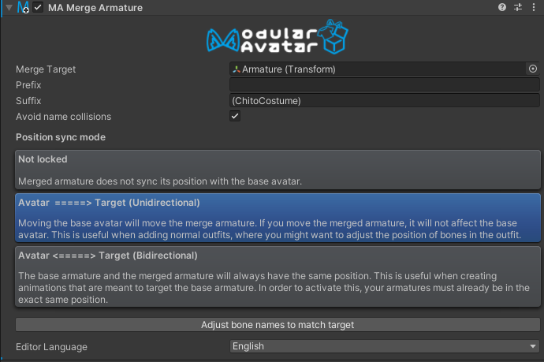
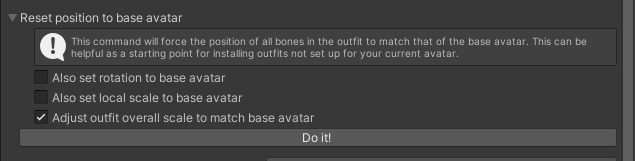

# Merge Armature

**Merge Armature** 组件会将一个游戏对象树集成到Avatar的骨架中。

## 我应该何时使用它？

**Merge Armature** 是衣装资产专用的组件，它对 **Skinned Mesh Renderer** 进行了调整，并进行特殊处理以最大限度地减少添加的骨骼。
你应该在添加需要跟随Avatar骨架的蒙皮网格时使用它。

## 我不应该何时使用它？

**Merge Armature** 不适用于需要兼容多种Avatar的通用资产。例如，它不推荐用于通用型指尖笔资产（你应该使用 **[Bone Proxy](bone-proxy.md)**）。
它更适合用于为特定Avatar设计的资产。

## 设置 Merge Armature

将 **Merge Armature** 组件添加到要合并的游戏对象树的根部，然后将Avatar上的对应骨骼（目标骨骼）拖放到“目标”字段中。
“前缀”和“后缀”将自动设置。

## 详细说明

该组件会遍历你添加的游戏对象树，并根据名称从目标骨骼中查找匹配的骨骼。
为了提高与现有资产的兼容性，你也可以指定在查找目标骨骼时需要剥离的前缀和后缀。

如果找到匹配的骨骼，它会尝试将对源骨骼的引用重写为对目标骨骼的引用。如果无法重写，它会将骨骼作为目标骨骼的子对象添加。
如果找不到匹配的骨骼，它也会将骨骼作为子对象添加。

为了确保原始层级结构中配置的组件能够继续工作，该组件做了一些优化。特别是：
* **动画引用**：动画引用会自动根据需要重写为目标骨骼。`Transform` 动画可能会被定向到目标骨骼，而 `GameObject` 的开关动画则会保留在原始位置。
* **PhysBones** 和 **Contacts**：它们的 `Target` 字段会被重写为目标骨骼。此处理也适用于位于 **Merge Armature** 外部的 **PhysBones**。
* **其他组件**：其他组件会保持在原始位置，并通过约束跟随目标骨骼的运动。

如果一个骨骼包含 **Transform** 以外的组件，它将保持原样。其他骨骼原则上会在合并后被删除。
在需要时，`PhysBone` 的目标会被调整，并生成 `ParentConstraint`，以确保其正常工作。

从 Modular Avatar 1.7.0 版本开始，可以进行链式合并。也就是说，你可以将 A 合并到 B，再将 B 合并到 C。
Modular Avatar 会根据合并引用自动计算合并顺序。

## 位置追随模式

位置追随模式允许衣装在编辑模式下跟随基础Avatar的动作。这对于制作动画、检查姿势和拍摄截图非常有用。有三种模式可供选择：

* **无追随** - 在编辑模式下，衣装不会跟随基础Avatar的动作。
* **Avatar =======> 目标（单向）** 
  - 当基础Avatar移动时，衣装也会移动。但移动衣装时，基础Avatar不会移动。
  这种模式会保留衣装的契合度调整，因此通常推荐用于衣装导入。
* **Avatar \<======> 目标（双向）** 
  - 当基础Avatar移动时，衣装也会移动。移动衣装时，基础Avatar也会移动。
  这种模式适用于制作移动基础Avatar头发或耳朵的动画等高级用途。

当你使用 **Setup Outfit** 导入衣装时，位置追随模式会自动设置为“Avatar -> 目标（单向）”。
如有需要，你可以在检查器中更改它。

## 重置位置以匹配原始Avatar

在导入不兼容的衣装时，先大致调整位置，然后进行微调会很方便。**Merge Armature** 的设置界面中的“重置位置以匹配原始Avatar”工具就是为此目的而设计的。

点击“执行”按钮，衣装骨骼的位置将与基础Avatar骨骼的位置对齐。此外，还有以下附加选项：

* **“也对齐旋转”**：将每个骨骼的本地旋转也与基础Avatar骨骼的旋转对齐。这适用于特殊用途，特别是如果衣装不是用与基础Avatar相同的 3D 软件制作的，可能会导致不自然的行为。
* **“也对齐缩放”**：将每个骨骼的本地缩放也与基础Avatar骨骼的缩放对齐。这适用于你调整了基础Avatar骨骼缩放的情况。
* **“调整衣装的整体缩放以匹配Avatar”**：调整衣装的整体缩放以匹配基础Avatar。它会根据Avatar的手臂长度来确定整体大小，并在位置对齐之前放大/缩小整个衣装。这适用于设置不兼容的衣装。

这些选项的设置不会被保存，只在点击“执行”时应用一次。

## 对象引用

在编辑器中，你可以通过拖放来指定合并目标，但在内部，它会以路径形式保存。这意味着即使创建预制件，也能正确保存合并目标。

## 骨骼名称匹配

因为 **Merge Animator** 通过名称匹配骨骼，所以仅仅添加组件可能无法让不兼容的衣装正常工作。
作为解决方案，你可以点击“将骨骼名称与目标对齐”按钮，让衣装的骨骼名称自动与Avatar的骨骼名称对齐。
请注意，当使用 **Setup Outfit** 添加 **Merge Armature** 时，此过程会自动运行。

## 避免名称冲突

如果存在与目标骨骼名称一致的骨骼，它们会被合并。但对于源骨骼中不存在于目标骨骼中的骨骼，它们会被重命名后放置。
这是为了避免与碰巧有相同名称骨骼的其他资产发生冲突。

在特殊情况下，如果你想禁用此功能，请取消勾选“避免名称冲突”。