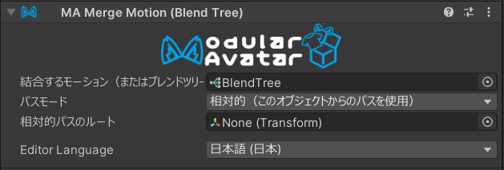

# Merge Motion (Blend Tree)

**Merge Motion** 组件允许你将多个动画或混合树合并到一个 FX 图层。
这是一个高级组件，通过将多个小工具合并到一个图层中，从而构建开销更低的动画控制器。
它也可以用于设置一个始终运行的动画。

:::info

在 1.12 版本之前，此组件被称为“Merge Blend Tree”。在 1.12 中，它被扩展以支持合并动画剪辑，因此名称更改为“Merge Motion”。使用 1.11 或更早版本创建的现有资产将自动升级为使用新的 Merge Motion 组件。

出于 API 兼容性的目的，此组件在内部仍被称为 `ModularAvatarMergeBlendTree`。

:::

## 我应该何时使用它？

当你有一个想要在虚拟形象中始终处于激活状态的运动（动画剪辑或混合树）时，应该使用 **Merge Motion**。

## 我不应该何时使用它？

如果你需要禁用/启用运动，或控制运动时间，则不应该使用 **Merge Motion**。

## 合并混合树的设置

首先，创建一个 **Blend Tree** 资产。你可以在项目窗口中右键点击，然后选择 **Create -> BlendTree**。

按照需要配置你的混合树，然后添加一个 **Merge Motion** 组件，并在“运动”字段中指定该混合树。

你可以像 **Merge Animator** 一样配置“路径模式”和“相对路径根”；更多细节，请参阅 **[Merge Animator 文档](merge-animator.md)**。

## 合并动画的设置

只需将动画放入“要合并的运动（或混合树）”字段。该动画将持续播放。

## 运动是如何合并的

Modular Avatar 会在 FX 控制器的顶部创建一个新图层。此图层将包含一个带有 **Write Defaults On** 的单一状态，其中包含一个 **Direct Blend Tree**。每个合并的运动都将附加到这个 **Direct Blend Tree** 上，其参数始终设置为 1。