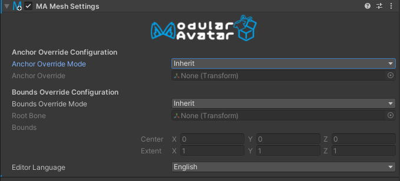

# Mesh Settings

**Mesh Settings** 组件允许你为一个特定游戏对象下的所有网格设置某些网格设置（锚点覆盖和边界）。

## 我应该何时使用它？

你可以将此组件放置在虚拟形象的顶层，以确保虚拟形象中所有网格的边界和 Light Probe 锚点保持一致。

“Setup Outfit”功能也会自动为新添加的衣装配置一个 **Mesh Settings** 组件。

最后，**Mesh Settings** 也可以用来**排除**网格，使其不受层级结构中更高位置的 **Mesh Settings** 的影响。

## 我不应该何时使用它？

在为分发资产配置边界或 Light Probes 时需要小心，因为这些配置可能与它们所应用的虚拟形象不一致。一般来说，这些设置只应在为特定虚拟形象设计的资产上设置。

## 手动配置 Mesh Settings

当你向一个游戏对象添加 **Mesh Settings** 时，它最初被配置为不执行任何操作。为了让这个设置组件生效，你需要更改“锚点覆盖模式”和/或“边界覆盖模式”。它们支持以下选项：

- **继承**：此组件对此设置不执行任何操作；它将继承父级 **Mesh Settings** 中设置的值。
- **设置**：此组件会设置其游戏对象或其子对象上的任何网格的相应设置。
- **不设置**：此组件会**阻止**任何父级 **Mesh Settings** 的影响。网格将保持其默认设置。
- **若未指定则设置**：如果存在处于“设置”模式的父级 **Mesh Settings**，它将被使用。如果没有父级 **Mesh Settings** 应用，则使用此组件的设置。这对于衣装预制件很有用，可以确保任何虚拟形象范围的设置优先。

配置边界时，包围盒将相对于你指定为“根骨骼”的变换来确定。请注意，边界仅影响 **Skinned Mesh Renderers**，但锚点覆盖也影响其他类型的渲染器，如 **Mesh Renderers** 或 **Line Renderers**。