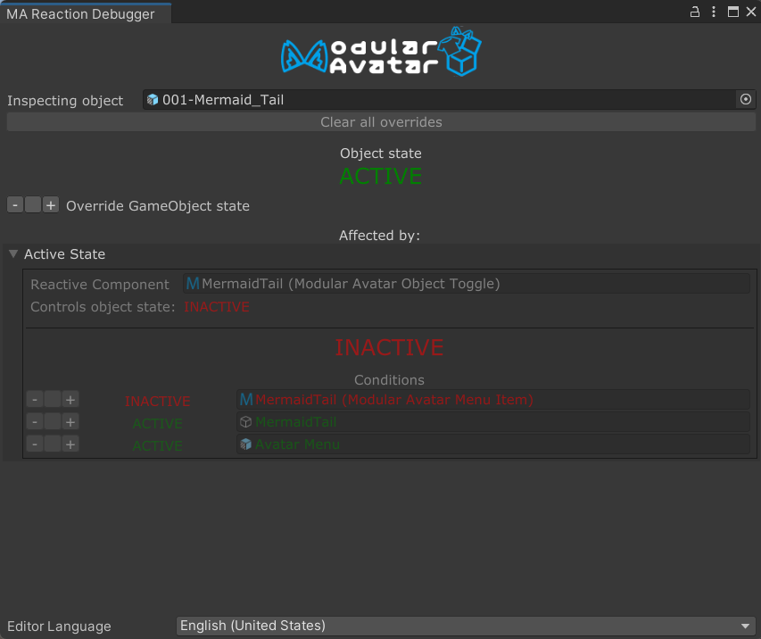
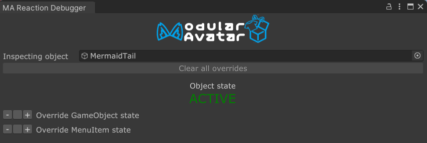
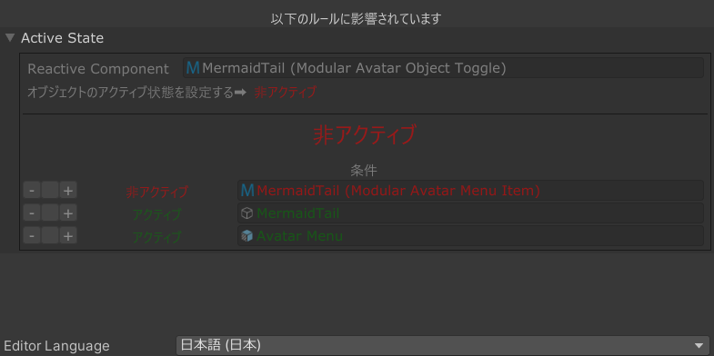

---
sidebar_position: 900
---

# Reaction Debugger

**Reaction Debugger** 允许你虚拟地更改场景中菜单项和游戏对象的状态，以便在不手动与Avatar互动的情况下测试你的反应式组件的行为。

要打开Reaction Debugger，请右键点击一个游戏对象，然后选择 `Modular Avatar -> Show Reaction Debugger`。
或者，你也可以点击一个反应式组件上的 `Open reaction debugger` 按钮来打开它。

调试器窗口分为两个部分：一个显示对象本身的状态，另一个显示影响该对象的反应。

## 对象状态部分

上半部分允许你通过更改 `Inspecting object` 字段来选择要检查的对象。默认情况下，它会显示当前选中的对象，但你可以更改该字段以检查其他对象。
与检查器窗口一样，你可以锁定视图，以避免在你选择场景中的不同对象时它发生变化。

在 `Inspecting object` 字段下方，有一个按钮可以清除所有活动的覆盖。稍后会详细介绍。我们还会看到一个 `Object state: ACTIVE`，这表明该对象（虚拟地）是活动的。

下面有两个选项可以强制对象处于活动/非活动状态，以及强制关联的菜单项处于选中/未选中状态。点击 `-` 或 `+` 按钮可以触发这种强制状态，或点击中间的（空白）按钮来清除覆盖。

强制对象为“活动”或“非活动”并不会真正改变它在层级结构中的状态，但它会在场景视图窗口中显示为已启用或已禁用。

## 反应部分

反应部分显示了所有影响此对象的“传入”反应。它还显示了触发反应需要满足的条件，并允许你轻松覆盖这些条件。