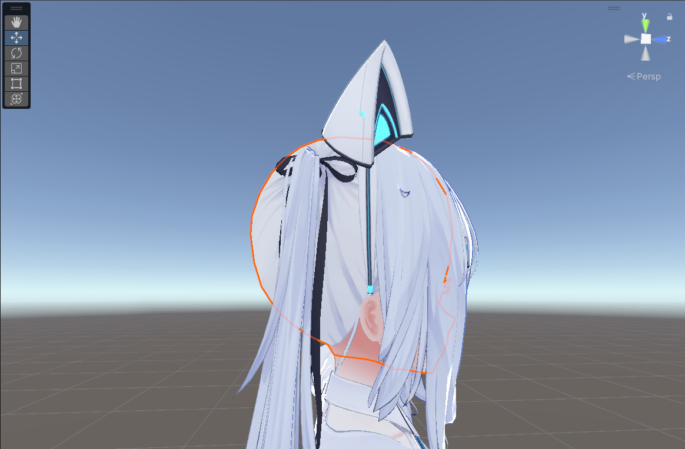

# Remove Vertex Color

**Remove Vertex Color** 组件用于删除附加对象及其子对象上的顶点颜色。

## 我应该何时使用它？

有时，虚拟形象或衣装会附带一些不必要的顶点颜色。当切换到使用顶点颜色的着色器（如 VRChat Mobile 上的某些着色器）时，这可能会导致变色问题。使用此组件可以非破坏性地删除这些有问题的顶点颜色。

    

        

        
        

        *如果不使用 Remove Vertex Color，此虚拟形象的头发将因不必要的顶点颜色而变色。*
    

    

        

        
        

        *添加 Remove Vertex Color 后，虚拟形象的头发颜色恢复正常。*
    

## 详细使用方法

将 **Remove Vertex Color** 组件添加到你的虚拟形象对象上。通常，将其添加到根对象就足够了。
它将删除此对象及其子对象下所有网格的顶点颜色。

如果你想排除特定对象，可以向该对象添加 **Remove Vertex Color** 组件，并将模式设置为“不删除顶点颜色”。此对象及其子对象下的所有网格的顶点颜色都不会被删除。