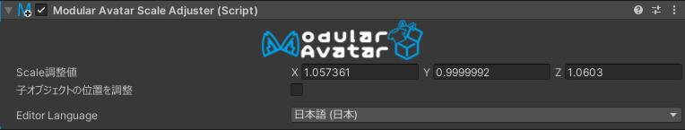
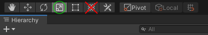

# Scale Adjuster

**Scale Adjuster** 组件允许你在不引起旋转子骨骼问题的情况下，调整特定骨骼的 X/Y/Z 缩放。

## 我应该何时使用它？

此组件主要用于调整并非为你的Avatar设计的衣装的契合度。你可以使用它来调整特定骨骼的尺寸，而不会破坏子骨骼。

## 我不应该何时使用它？

当调整骨骼的整体缩放时（X/Y/Z 等比例调整），通常最好使用标准的 Unity 缩放工具。

## 设置 Scale Adjuster

只需将 **Scale Adjuster** 组件添加到相关骨骼上。现在，当你选择缩放工具时，更改将仅影响这一个骨骼。

你可以勾选或取消勾选“调整子对象位置”复选框，以在父对象缩放更改时调整子骨骼的相对位置。这在你想要调整骨骼的缩放，但又不想移动子骨骼时很有用。请注意，这只调整子骨骼的**位置**，而不调整它们的缩放。

**Scale Adjuster** 支持通过将组件添加到所有相关骨骼，然后多选这些骨骼再调整缩放来同时调整多个骨骼的缩放。但是，如果这些骨骼已旋转，缩放调整可能不完美，并且可能无法得到你期望的结果。

:::warning

**Scale Adjuster** 只控制 Unity 的缩放工具。组合的“移动/旋转/缩放”工具仍然会影响所有子对象。

:::