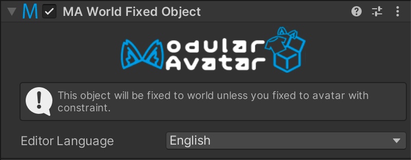

# World Fixed Object

此组件可用于使一个游戏对象相对于世界保持静止，即使Avatar移动也是如此。

## 我应该何时使用它？

当你希望某个道具或对象在你的Avatar移动时保持在原地不动时。

## 设置 World Fixed Object

将 `World Fixed Object` 组件附加到一个游戏对象上。没有可配置的选项。

该组件将自动在Avatar根部生成一个世界原点固定的游戏对象，并将你的游戏对象移动为其子对象。你可以使用 **Parent Constraints** 等组件来控制 **World Fixed Object** 内游戏对象的位置。

即使使用了多个 **World Fixed Object** 组件，也只会生成一个约束。因此，使用一个或多个此组件的性能影响是相同的。

由于 Quest 上的技术限制，此组件在为 Quest 独立版构建时无法使用。