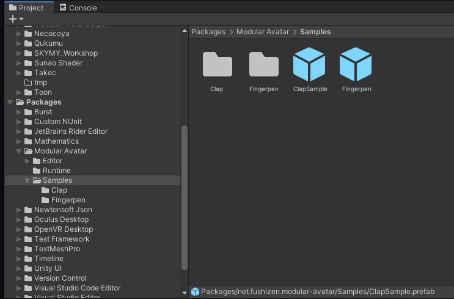

---
sidebar_position: 3
sidebar_label: 示例资产
---

# 示例资产

Modular Avatar 附带了几个示例预制件来演示其功能。这些可以在你项目窗口的 `Packages -> Modular Avatar -> Samples` 下找到。

## 指尖笔（Fingerpen） {#fingerpen}

指尖笔预制件是一个方便的笔，可以在任何地方使用。
只需将其拖放到你的虚拟形象上，然后点击 **Menu Installer** 组件中的“选择菜单”按钮，并双击你想要安装指尖笔控件的菜单。

指尖笔预制件演示了以下功能：

* 使用 **[Merge Animator](/docs/reference/merge-animator)** 安装动画控制器。
* 自动配置 **[同步参数](/docs/reference/parameters)**。
* 设置 **[菜单](/docs/reference/menu-installer)**。
* 使用 **[Bone Proxy](/docs/reference/bone-proxy)** 组件以与虚拟形象无关的方式将对象放置在虚拟形象的骨骼内部。

## 拍手（Clap） {#clap}

通过将拍手预制件拖放到你的虚拟形象上，当你将双手合拢时，你会听到拍手音效，并生成一些粒子。
与指尖笔一样，点击“选择菜单”按钮来选择放置开关的位置。

除了指尖笔预制件中演示的所有功能外，拍手示例还展示了如何将 **Contact Receiver** 的值用于内部参数，以避免与其他组件发生参数冲突。