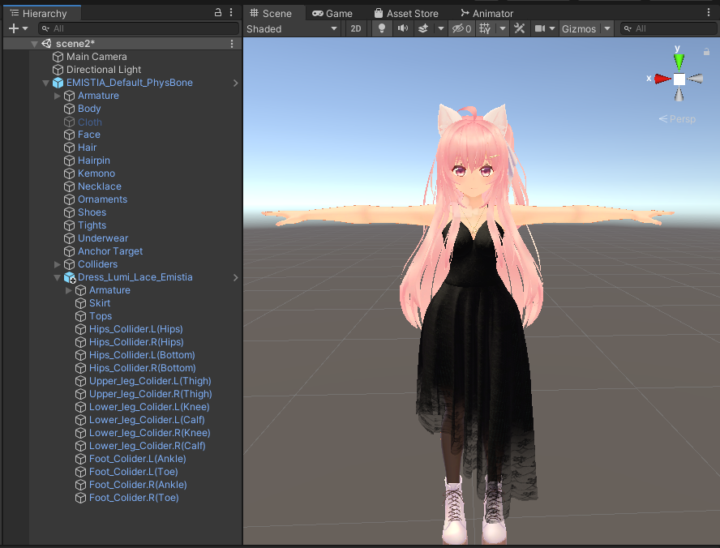
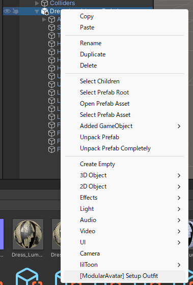
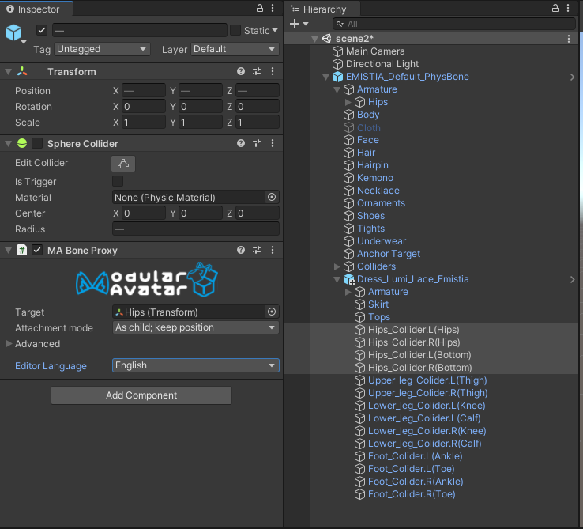
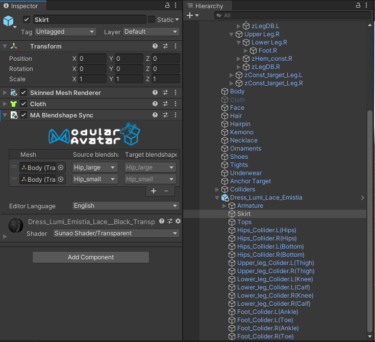
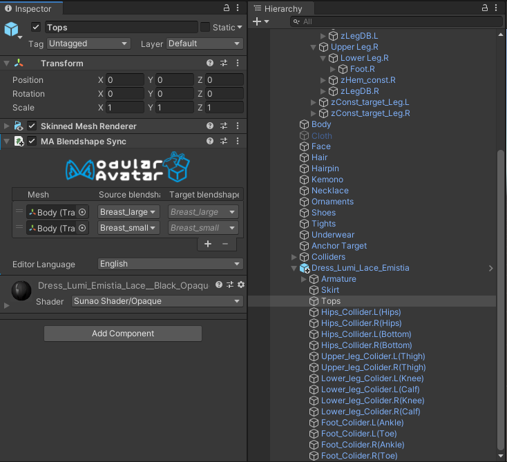

---
sidebar_position: 2
sidebar_label: 配置复杂的衣装
---

# 配置复杂的衣装

在某些情况下，自动设置不足以配置复杂的衣装。
让我们以 Lachexia 的 [**Dress Lumi**](https://lachexia.booth.pm/items/3763311) 为例。

本教程假定你已完成 **[简单衣装教程](/docs/tutorials/clothing)**，并会跳过其中涵盖的一些细节。

我们从将 Dress Lumi 预制件拖放到Avatar上开始，并隐藏了与新衣装冲突的原始Avatar衣物（即，隐藏 Cloth，并在 Underwear 上设置 `bra_off`）。

如你所见，这套衣装有很多额外的对象。**[简单衣装教程](/docs/tutorials/clothing)** 中描述的自动设置会为我们创建 **Merge Armature** 组件，但其余对象需要多一点设置。尽管如此，这仍然是正确的起点：

接下来，我们需要设置 **Bone Proxies**，让所有碰撞体对象跟随其基础骨骼移动。首先，我们选择所有的 “Hips_Collider” 对象，然后一次性将 **`MA Bone Proxy`** 添加到所有这些对象上。在“目标”下，从原始Avatar中拖放 Hips 对象。

请注意，当你这样做时，“附件模式”会自动更新为“作为子对象；保持位置”。

对其他骨骼/碰撞体也做同样的操作。这样，布料碰撞体应该就能工作了：

最后，为 Skirt 和 Tops 设置 **Blendshape Sync** 组件：

## 其他扩展

你可以通过添加 **Merge Animator** 组件来完全自动化这套衣装的设置，该组件将设置基础 Body 的 Blendshape（torso_thin => 100, elbow_off => 0, bra_off => 100），并禁用 Cloth。
然而，这可能会干扰衣装切换器的配置，因此不推荐。