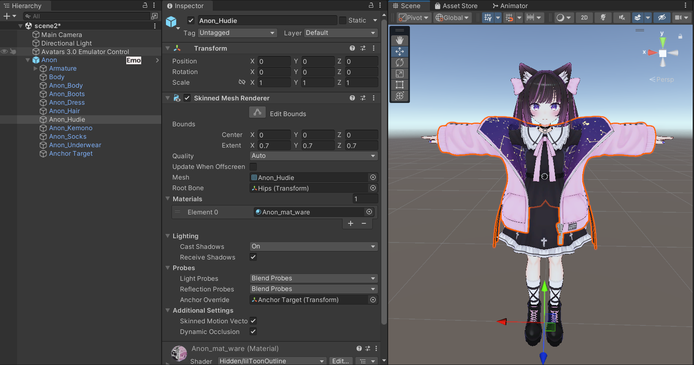
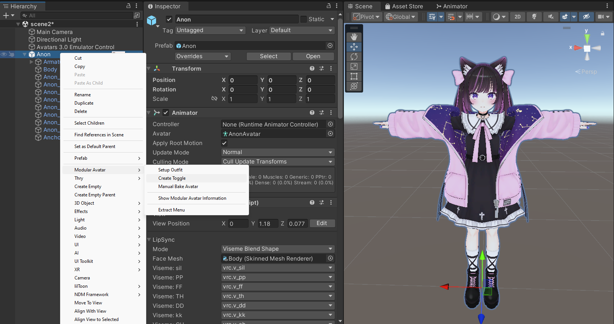
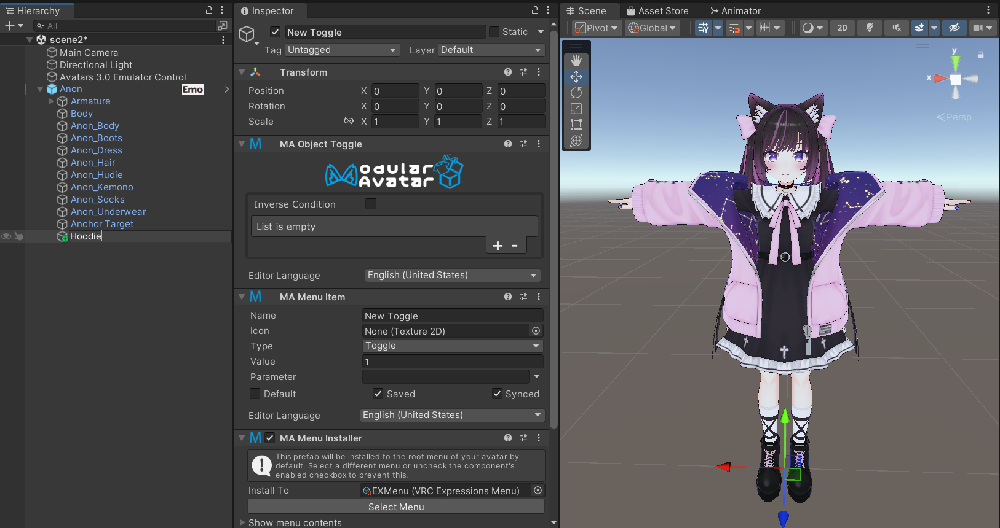
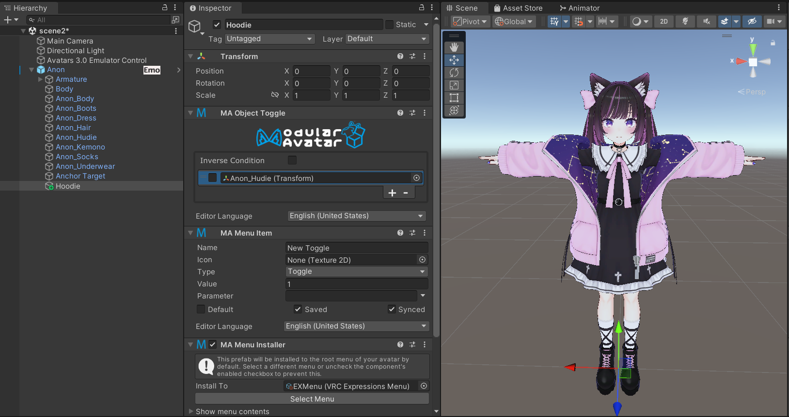
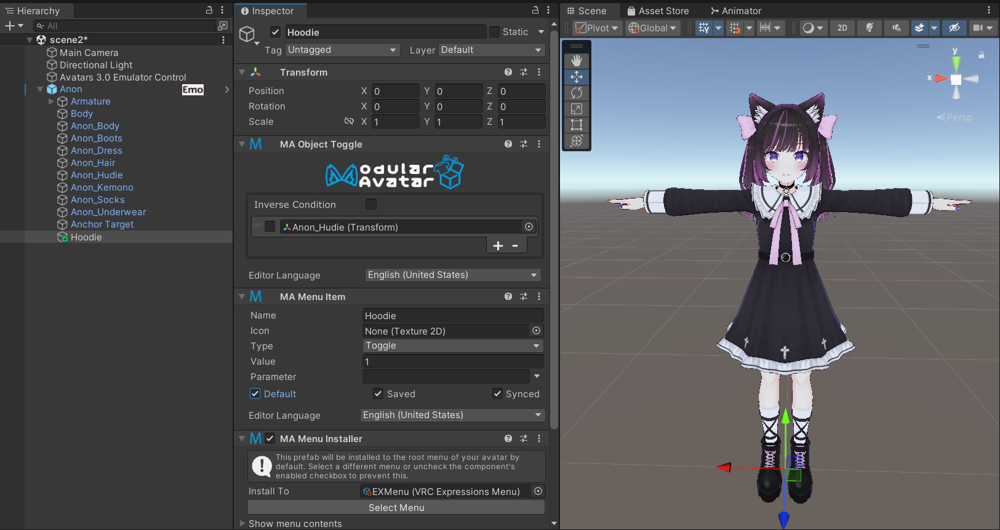

---
sidebar_position: 3
---

# 简单的对象开关

在本教程中，我们将学习如何使用 Modular Avatar 的反应式组件系统，创建一个简单的菜单项来开关一个对象。

我们将尝试开关 Anon-chan 的连帽衫。

首先，右键点击你的虚拟形象，然后选择 `Modular Avatar -> Create Toggle`。

完成后，一个新的游戏对象将作为你的虚拟形象的子对象被创建，其中包含 `Menu Item`、`Menu Installer` 和 `Object Toggle` 组件。

在 `Object Toggle` 上，点击 `+` 按钮添加一个新条目。将你想要开关的对象拖到空白字段中。因为我们希望这个菜单项关闭连帽衫，所以我们将复选框留空。

至此，你的开关已完全配置好。如果你想看到它的效果，点击 **Menu Item** 上的 `Default` 复选框，你应该会看到连帽衫消失。

